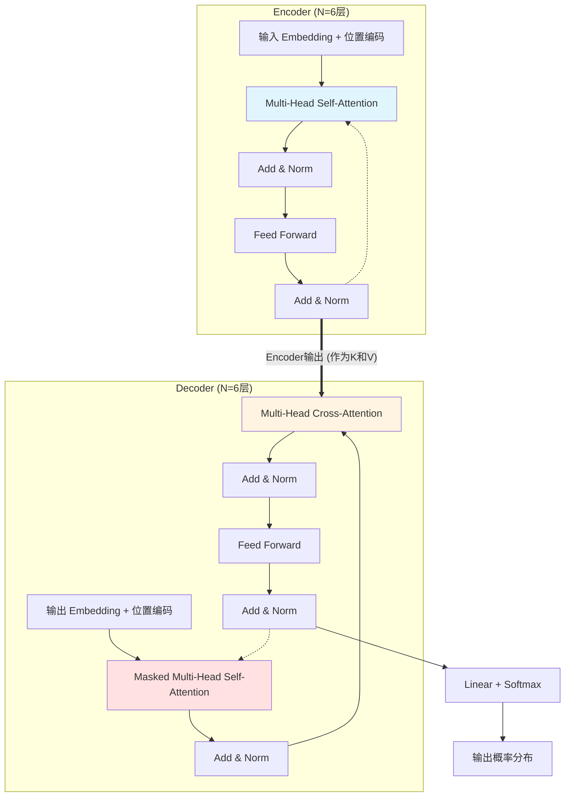
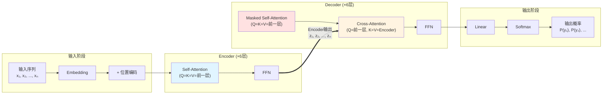

# 第02章：Transformer架构全景图——Encoder、Decoder与三种Attention的数据流

> **论文链接**：[Attention Is All You Need](https://proceedings.neurips.cc/paper_files/paper/2017/file/3f5ee243547dee91fbd053c1c4a845aa-Paper.pdf) (Vaswani et al., NIPS 2017)  
> **本章对应**：Section 3.1, Section 3.2.3, Figure 1

## 核心困惑

Transformer的整体架构是什么样的？Encoder和Decoder各自干什么？三种Attention有什么区别？

第01章讲了"为什么要用Attention"，但还没讲"Attention怎么组装成一个完整的模型"。Transformer不是简单地把Attention堆起来，而是精心设计了Encoder-Decoder结构，并且用了**三种不同的Attention**。

这三种Attention长得很像，但作用完全不同。搞混它们，面试直接挂。

## 前置知识补给站

### 1. Encoder-Decoder架构的本质

Encoder-Decoder是序列到序列（Seq2Seq）任务的标准架构：

- **Encoder**：把输入序列$(x_1, ..., x_n)$编码成一组连续表示$(z_1, ..., z_n)$
- **Decoder**：根据编码$z$，自回归地生成输出序列$(y_1, ..., y_m)$

**关键特性**：
- Encoder可以看到完整的输入序列（双向）
- Decoder只能看到已经生成的输出（单向，因果性）

### 2. 自回归生成

Decoder在生成第$t$个token时，只能依赖：
- 已经生成的token：$y_1, ..., y_{t-1}$
- Encoder的输出：$z_1, ..., z_n$

不能"偷看"未来的token $y_t, y_{t+1}, ...$，否则就是作弊。

### 3. 残差连接与Layer Normalization

每个子层的输出都经过：
$$\text{LayerNorm}(x + \text{Sublayer}(x))$$

这是Post-LN架构（原论文使用）。现代模型多用Pre-LN，我们在第05章详细讨论。

## 论文精读：Transformer的整体架构

### 架构概览

**原论文Section 3.1**：
> "The Transformer follows this overall architecture using stacked self-attention and point-wise, fully connected layers for both the encoder and decoder."

Transformer由两部分组成：
- **Encoder**：N=6层，每层包含两个子层
- **Decoder**：N=6层，每层包含三个子层

<thinking>
用户要求图要适配PC和手机端。我应该用Mermaid图来绘制架构，因为Mermaid图是文本格式，可以自适应屏幕大小。

让我用Mermaid绘制Transformer的整体架构。
</thinking>

### Transformer架构图（简化版）



**图例说明**：
- 🔵 蓝色：Encoder Self-Attention
- 🔴 红色：Decoder Masked Self-Attention
- 🟡 黄色：Decoder Cross-Attention
- 虚线箭头：表示循环（堆叠N层）
- 粗箭头：Encoder输出传递给Decoder

### Encoder的层次结构

**原论文Section 3.1**：
> "The encoder is composed of a stack of N = 6 identical layers. Each layer has two sub-layers. The first is a multi-head self-attention mechanism, and the second is a simple, position-wise fully connected feed-forward network."

**Encoder的每一层包含**：

1. **Multi-Head Self-Attention**
   - 输入：前一层的输出（或embedding）
   - 作用：让每个位置关注输入序列的所有位置
   - Q/K/V来源：都来自前一层

2. **Feed-Forward Network (FFN)**
   - 两层全连接网络，中间用ReLU激活
   - 公式：$\text{FFN}(x) = \max(0, xW_1 + b_1)W_2 + b_2$
   - 维度：$d_{model} = 512 \to d_{ff} = 2048 \to d_{model} = 512$

3. **残差连接 + Layer Normalization**
   - 每个子层后都有：$\text{LayerNorm}(x + \text{Sublayer}(x))$

**数据流**：
$$\begin{aligned}
x_1 &= \text{Embedding}(input) + \text{PositionalEncoding} \\
x_2 &= \text{LayerNorm}(x_1 + \text{MultiHeadAttention}(Q=x_1, K=x_1, V=x_1)) \\
x_3 &= \text{LayerNorm}(x_2 + \text{FFN}(x_2)) \\
&\text{重复6次...} \\
z &= x_{final} \quad \text{(Encoder输出)}
\end{aligned}$$

### Decoder的层次结构

**原论文Section 3.1**：
> "The decoder is also composed of a stack of N = 6 identical layers. In addition to the two sub-layers in each encoder layer, the decoder inserts a third sub-layer, which performs multi-head attention over the output of the encoder stack."

**Decoder的每一层包含**：

1. **Masked Multi-Head Self-Attention**
   - 输入：前一层的输出（或embedding）
   - 作用：让每个位置关注**已生成的**输出序列
   - **关键**：用mask防止"看到未来"

2. **Multi-Head Cross-Attention**
   - Q来源：Decoder前一层
   - K/V来源：**Encoder的输出**
   - 作用：让Decoder关注输入序列

   > **重要**：Encoder的输出$z$被送到**每一层**Decoder的Cross-Attention（共6次），而不是只送给第一层。这确保每一层Decoder都能直接访问输入信息。

3. **Feed-Forward Network (FFN)**
   - 与Encoder的FFN结构相同

4. **残差连接 + Layer Normalization**
   - 每个子层后都有

**数据流**：
$$\begin{aligned}
y_1 &= \text{Embedding}(output) + \text{PositionalEncoding} \\
y_2 &= \text{LayerNorm}(y_1 + \text{MultiHeadAttention}(Q=y_1, K=y_1, V=y_1, \text{mask}=\text{causal})) \\
y_3 &= \text{LayerNorm}(y_2 + \text{MultiHeadAttention}(Q=y_2, K=z, V=z)) \\
y_4 &= \text{LayerNorm}(y_3 + \text{FFN}(y_3)) \\
&\text{重复6次...} \\
\text{logits} &= \text{Linear}(y_{final}) \\
\text{probs} &= \text{Softmax}(\text{logits})
\end{aligned}$$

**注**：三种Attention都调用同一个`MultiHeadAttention`函数，只是传入的Q/K/V参数不同。这体现了Attention机制的统一性。

## 三种Attention的系统对比

这是本章的核心。三种Attention的公式都是：
$$\text{Attention}(Q, K, V) = \text{softmax}\left(\frac{QK^T}{\sqrt{d_k}}\right)V$$

但**Q/K/V的来源不同**，导致作用完全不同。

### 对比表格

| Attention类型 | 位置 | Q来源 | K来源 | V来源 | Mask | 作用 |
|:-------------|:-----|:------|:------|:------|:-----|:-----|
| **Encoder Self-Attention** | Encoder每层 | Encoder前一层 | Encoder前一层 | Encoder前一层 | 无 | 编码输入序列的上下文 |
| **Decoder Masked Self-Attention** | Decoder每层 | Decoder前一层 | Decoder前一层 | Decoder前一层 | 因果mask | 自回归生成，防止"看到未来" |
| **Decoder Cross-Attention** | Decoder每层 | Decoder前一层 | **Encoder输出** | **Encoder输出** | 无 | 让Decoder关注输入序列 |

### 详细解读

#### 1. Encoder Self-Attention

**原论文Section 3.2.3**：
> "The encoder contains self-attention layers. In a self-attention layer all of the keys, values and queries come from the same place, in this case, the output of the previous layer in the encoder."

**特点**：
- Q/K/V都来自Encoder前一层
- 所有位置互相可见（双向）
- 没有mask

**作用**：
- 让每个位置聚合整个输入序列的信息
- 例如："The cat sat on the mat"中，"cat"可以关注"The"和"sat"

**数学表达**：
$$\begin{aligned}
Q &= X W^Q \\
K &= X W^K \\
V &= X W^V \\
\text{Output} &= \text{Attention}(Q, K, V)
\end{aligned}$$

其中$X$是Encoder前一层的输出。

#### 2. Decoder Masked Self-Attention

**原论文Section 3.2.3**：
> "Similarly, self-attention layers in the decoder allow each position in the decoder to attend to all positions in the decoder up to and including that position. We need to prevent leftward information flow in the decoder to preserve the auto-regressive property."

**特点**：
- Q/K/V都来自Decoder前一层
- 只能看到当前及之前的位置（单向）
- **必须有因果mask**

**作用**：
- 让每个位置聚合已生成的输出序列的信息
- 防止"看到未来"，保证自回归性质

**Mask机制**：

在计算attention时，把未来位置的score设为$-\infty$：

$$\text{score}_{ij} = \begin{cases}
\frac{q_i \cdot k_j}{\sqrt{d_k}} & \text{if } j \leq i \\
-\infty & \text{if } j > i
\end{cases}$$

经过softmax后，未来位置的权重变为0。

**Mask矩阵示例**（4个位置）：

```
位置:  1    2    3    4
  1  [✓    ✗    ✗    ✗]
  2  [✓    ✓    ✗    ✗]
  3  [✓    ✓    ✓    ✗]
  4  [✓    ✓    ✓    ✓]
```

- ✓：可以attend（score正常计算）
- ✗：不能attend（score设为$-\infty$）

#### 3. Decoder Cross-Attention

**原论文Section 3.2.3**：
> "In 'encoder-decoder attention' layers, the queries come from the previous decoder layer, and the memory keys and values come from the output of the encoder. This allows every position in the decoder to attend over all positions in the input sequence."

**特点**：
- Q来自Decoder前一层
- K/V来自**Encoder的输出**
- 没有mask（可以看到完整的输入序列）

**作用**：
- 让Decoder关注输入序列
- 这是Encoder和Decoder之间的"桥梁"

**数学表达**：
$$\begin{aligned}
Q &= Y W^Q \quad \text{(来自Decoder)} \\
K &= Z W^K \quad \text{(来自Encoder)} \\
V &= Z W^V \quad \text{(来自Encoder)} \\
\text{Output} &= \text{Attention}(Q, K, V)
\end{aligned}$$

其中$Y$是Decoder前一层的输出，$Z$是Encoder的最终输出。

**直观理解**：
- 在机器翻译中，Decoder生成"猫"时，Cross-Attention会关注输入的"The cat"
- Q是"我现在要生成什么"，K/V是"输入序列有什么信息"

## 从计算图角度理解数据流

### 完整的前向传播流程

<thinking>
我需要用Mermaid绘制一个更详细的数据流图，展示从输入到输出的完整流程。
</thinking>



### 关键数据流路径

1. **输入 → Encoder → Encoder输出**
   - 输入序列经过6层Encoder
   - 每层都用Self-Attention聚合上下文
   - 最终输出$z = (z_1, ..., z_n)$

2. **Encoder输出 → Decoder Cross-Attention**
   - Encoder输出$z$被送到**每一层**Decoder的Cross-Attention
   - 作为K和V，让Decoder关注输入

3. **Decoder自回归生成**
   - Decoder用Masked Self-Attention处理已生成的序列
   - 用Cross-Attention关注输入
   - 用FFN做非线性变换
   - 最后用Linear + Softmax输出下一个token的概率

## 架构演化：为什么后续模型抛弃了Encoder-Decoder？

### Encoder-only：BERT (2018)

**架构**：
- 只用Encoder，去掉Decoder
- 用Masked Language Model (MLM)训练

**优势**：
- 双向上下文：可以同时看到左右两边
- 适合理解任务：分类、问答、NER

**劣势**：
- 不适合生成任务

### Decoder-only：GPT (2018-2024)

**架构**：
- 只用Decoder，去掉Encoder和Cross-Attention
- 用Causal Language Model训练

**优势**：
- 统一的训练目标：next token prediction
- 架构更简单：只需要Masked Self-Attention
- 更容易扩展到超大规模

**劣势**：
- 只能单向建模（但在生成任务上这不是问题）

### 为什么Decoder-only在通用语言建模中胜出？

1. **训练数据的性质**：互联网文本是连续的，不需要显式的输入-输出对齐
2. **架构简洁性**：Decoder-only不需要Cross-Attention，参数量全部集中在Decoder上，更容易扩展到超大规模。而且KV Cache只需要缓存Decoder自己的K和V，不需要额外缓存Encoder的输出
3. **统一的训练目标**：next token prediction，更简单高效

**但Encoder-Decoder并未消失**：
- 机器翻译：仍然是SOTA
- 语音识别：Whisper使用Encoder-Decoder
- 多模态：Flamingo、LLaVA等模型本质上是"视觉Encoder + 语言Decoder"

详见第09章的深入分析。

## 2026年的批判性视角

### 1. Cross-Attention的计算成本

原论文的Decoder每一层都要访问完整的Encoder输出。

**内存占用**：
- Encoder输出：$n \times d_{model}$
- 每层Decoder都要存储K和V：$2 \times n \times d_{model}$
- 6层Decoder：$12 \times n \times d_{model}$

当$n$很大时（如长文档翻译），这是一个瓶颈。

### 2. Encoder-Decoder的训练不平衡

在原论文的机器翻译任务中，Encoder和Decoder的层数相同（都是6层）。但：
- Encoder只需要编码输入
- Decoder需要编码输出、关注输入、生成token

Decoder的任务更重，是否应该更深？原论文没有讨论。

### 3. 因果mask的严格性

Decoder的因果mask是严格的：位置$i$完全看不到位置$i+1$。

但在某些任务中（如文本编辑、填空），允许"向前看几步"可能更合理。这促使了：
- Prefix LM（T5的变体）
- 非因果Decoder（用于理解任务）

### 4. 三种Attention的统一性

三种Attention的公式相同，只是Q/K/V来源不同。这暗示了一个更统一的框架：
- 所有Attention都是"用Q查询K/V"
- 区别只在于"查询谁"

这个统一性在后续研究中被进一步探索（如Universal Transformer）。

## 面试追问清单

### ⭐ 基础必会

1. **Encoder和Decoder各有几层？每层包含哪些子层？**
   - 提示：Encoder 2个子层，Decoder 3个子层

2. **三种Attention的Q/K/V分别来自哪里？**
   - 提示：画一个表格对比

3. **为什么Decoder需要Masked Self-Attention？**
   - 提示：自回归性质、防止"看到未来"

### ⭐⭐ 进阶思考

4. **Cross-Attention的K和V为什么都来自Encoder输出？能否只用K或只用V？**
   - 提示：K用于计算相似度，V用于加权求和，缺一不可

5. **如果去掉Cross-Attention，Decoder还能工作吗？**
   - 提示：这就是GPT的架构，但需要把输入和输出拼接在一起

6. **为什么Encoder的Self-Attention不需要mask，但Decoder需要？**
   - 提示：Encoder是双向的，Decoder是单向的

### ⭐⭐⭐ 专家领域

7. **证明：在Encoder-Decoder架构中，Decoder的每一层都需要访问Encoder输出，而不能只在第一层访问。**
   - 提示：从梯度流和信息传递的角度分析

8. **如何设计一个统一的架构，既能做Encoder-only任务（如分类），又能做Decoder-only任务（如生成）？**
   - 提示：T5的Prefix LM、GLM的自回归空白填充

9. **原论文的Encoder和Decoder都是6层。如果让你重新设计，你会如何分配层数？**
   - 提示：考虑任务复杂度、参数量、训练效率

---

**下一章预告**：第03章将深入拆解Scaled Dot-Product Attention，回答"那个$\sqrt{d_k}$到底在防什么"。

**论文原文传送门**：
- Transformer原论文：https://arxiv.org/abs/1706.03762
- 官方代码：https://github.com/tensorflow/tensor2tensor
