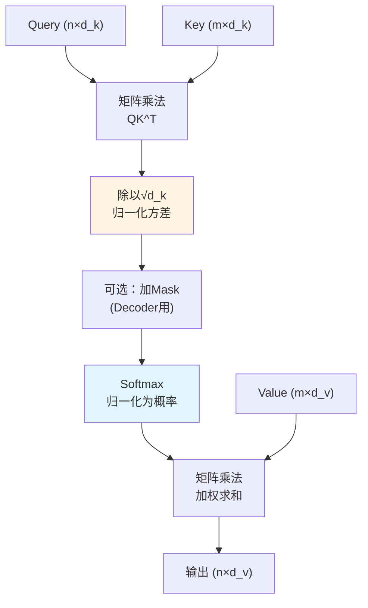

# 第03章：Scaled Dot-Product Attention——那个√d_k到底在防什么？

> **论文链接**：[Attention Is All You Need](https://proceedings.neurips.cc/paper_files/paper/2017/file/3f5ee243547dee91fbd053c1c4a845aa-Paper.pdf) (Vaswani et al., NIPS 2017)  
> **本章对应**：Section 3.2.1, Footnote 4

## 核心困惑

为什么Attention公式里要除以$\sqrt{d_k}$？不除会怎样？

这个$\sqrt{d_k}$看起来不起眼，但它在防一个致命问题。如果你在面试时被问"Scaled Dot-Product Attention的Scaled是什么意思"，答不出来就直接挂了。

完整的Attention公式是：
$$\text{Attention}(Q, K, V) = \text{softmax}\left(\frac{QK^T}{\sqrt{d_k}}\right)V$$

为什么是$\sqrt{d_k}$而不是$d_k$或者$d_k^2$？这背后有严格的数学推导。

## 前置知识补给站

### 1. 向量点积的几何意义

两个向量$q$和$k$的点积：
$$q \cdot k = \sum_{i=1}^{d_k} q_i k_i = \|q\| \|k\| \cos\theta$$

**几何意义**：
- 点积衡量两个向量的相似度
- 点积越大，向量越相似（夹角越小）
- 点积可以是负数（夹角>90°）

### 2. 随机变量的方差

对于随机变量$X$：
$$\text{Var}(X) = E[(X - E[X])^2] = E[X^2] - (E[X])^2$$

**方差的性质**：
- $\text{Var}(aX) = a^2 \text{Var}(X)$
- 如果$X$和$Y$独立：$\text{Var}(X + Y) = \text{Var}(X) + \text{Var}(Y)$

### 3. Softmax函数的饱和区

Softmax函数：
$$\text{softmax}(x_i) = \frac{e^{x_i}}{\sum_j e^{x_j}}$$

**饱和区问题**：
- 当某个$x_i$远大于其他$x_j$时，$\text{softmax}(x_i) \approx 1$，其他位置$\approx 0$
- 此时梯度$\frac{\partial \text{softmax}}{\partial x_j} \approx 0$（$j \neq i$）
- 这叫"饱和"，会导致梯度消失

## 论文精读：为什么需要缩放？

### 原论文的解释

**Section 3.2.1**：
> "We call our particular attention 'Scaled Dot-Product Attention'. The input consists of queries and keys of dimension $d_k$, and values of dimension $d_v$. We compute the dot products of the query with all keys, divide each by $\sqrt{d_k}$, and apply a softmax function to obtain the weights on the values."

**Footnote 4**（关键）：
> "We suspect that for large values of $d_k$, the dot products grow large in magnitude, pushing the softmax function into regions where it has extremely small gradients. To counteract this effect, we scale the dot products by $\frac{1}{\sqrt{d_k}}$."

翻译成人话：
1. 当$d_k$很大时，点积的值会很大
2. 大的点积会让Softmax进入饱和区
3. 饱和区的梯度极小，导致梯度消失
4. 除以$\sqrt{d_k}$可以把点积的值控制在合理范围

**但原论文没有证明"为什么是$\sqrt{d_k}$"**。我们来严格推导。

## 第一性原理推导：为什么是√d_k？

### 推导1：随机向量点积的方差

**假设**（理想化数学模型）：
- $q$和$k$是$d_k$维随机向量
- $q = xW^Q$，$k = xW^K$，其中$W^Q$和$W^K$在初始化时独立
- 每个分量$q_i, k_i$的均值为0，方差为1
- $q$的各分量不相关，$k$的各分量不相关

> **注**：实践中这些假设通过LayerNorm近似满足。

**目标**：计算点积$q \cdot k$的方差。

**推导**：

首先计算期望：
$$\begin{aligned}
q \cdot k &= \sum_{i=1}^{d_k} q_i k_i \\
E[q \cdot k] &= \sum_{i=1}^{d_k} E[q_i k_i]
\end{aligned}$$

在初始化时，$W^Q$和$W^K$独立初始化，因此对于固定的输入$x$，$q_i$和$k_i$条件独立：
$$E[q_i k_i | x] = E[q_i | x] \cdot E[k_i | x]$$

由于投影后的向量均值为0（假设），因此：
$$E[q \cdot k] = 0$$

接下来计算方差：
$$\begin{aligned}
\text{Var}(q \cdot k) &= E[(q \cdot k)^2] - (E[q \cdot k])^2 \\
&= E[(q \cdot k)^2] \\
&= E\left[\left(\sum_{i=1}^{d_k} q_i k_i\right)^2\right] \\
&= E\left[\sum_{i=1}^{d_k} q_i^2 k_i^2 + \sum_{i \neq j} q_i k_i q_j k_j\right]
\end{aligned}$$

对于$i \neq j$的交叉项，由于$q$和$k$来自不同的投影矩阵：
$$E[q_i k_i q_j k_j] = E[(q_i q_j)(k_i k_j)] = E[q_i q_j] \cdot E[k_i k_j]$$

如果$q$的各分量不相关且均值为0，则$E[q_i q_j] = \text{Cov}(q_i, q_j) + E[q_i]E[q_j] = 0$（$i \neq j$）。同理$E[k_i k_j] = 0$。因此交叉项期望为0。

对于对角项：
$$\begin{aligned}
\sum_{i=1}^{d_k} E[q_i^2 k_i^2] &= \sum_{i=1}^{d_k} E[q_i^2] E[k_i^2] \quad \text{(}q\text{和}k\text{独立)} \\
&= \sum_{i=1}^{d_k} \text{Var}(q_i) \cdot \text{Var}(k_i) \quad \text{(均值为0)} \\
&= \sum_{i=1}^{d_k} 1 \cdot 1 \\
&= d_k
\end{aligned}$$

因此：
$$\text{Var}(q \cdot k) = d_k$$

**结论**：点积$q \cdot k$的方差是$d_k$。

**标准差**：$\sqrt{\text{Var}(q \cdot k)} = \sqrt{d_k}$

**归一化**：如果我们除以$\sqrt{d_k}$：
$$\text{Var}\left(\frac{q \cdot k}{\sqrt{d_k}}\right) = \frac{1}{d_k} \text{Var}(q \cdot k) = \frac{1}{d_k} \cdot d_k = 1$$

**这就是为什么是$\sqrt{d_k}$**：它把点积的方差归一化到1，无论$d_k$多大。

### 推导2：Softmax饱和区的数值演示

**问题**：为什么点积过大会导致Softmax饱和？

**Softmax的梯度**：
$$\frac{\partial \text{softmax}(x_i)}{\partial x_j} = \begin{cases}
\text{softmax}(x_i)(1 - \text{softmax}(x_i)) & \text{if } i = j \\
-\text{softmax}(x_i) \text{softmax}(x_j) & \text{if } i \neq j
\end{cases}$$

**数值示例**：

假设有3个位置，点积为$[x_1, x_2, x_3]$。

**情况1**：点积适中（$d_k=64$，已缩放）
$$x = [1.0, 0.5, -0.5]$$
$$\text{softmax}(x) = [0.506, 0.307, 0.187]$$
$$\frac{\partial \text{softmax}(x_1)}{\partial x_1} = 0.506 \times (1 - 0.506) = 0.250$$

梯度正常，可以学习。

**情况2**：点积过大（$d_k=64$，未缩放）
$$x = [8.0, 4.0, -4.0]$$
$$\text{softmax}(x) = [0.9997, 0.0003, 0.0000]$$
$$\frac{\partial \text{softmax}(x_1)}{\partial x_1} = 0.9997 \times (1 - 0.9997) = 0.0003$$

梯度几乎为0，无法学习。

**可视化对比**：

| $d_k$ | 标准差 | 3σ范围 | Softmax状态 | 梯度 |
|:------|:-------|:-------|:------------|:-----|
| 64（已缩放） | 1 | [-3, 3] | ✅ 正常 | ~0.2 |
| 64（未缩放） | 8 | [-24, 24] | ❌ 饱和 | ~0.0 |
| 512（未缩放） | 22.6 | [-68, 68] | ❌ 极饱和 | ~0.0 |

### 推导3：为什么不是其他缩放因子？

**候选方案**：
1. 除以$d_k$：$\text{Var}(q \cdot k / d_k) = 1/d_k$，方差太小
2. 除以$\sqrt{d_k}$：$\text{Var}(q \cdot k / \sqrt{d_k}) = 1$，方差刚好
3. 除以$\log d_k$：$\text{Var}(q \cdot k / \log d_k) = d_k / (\log d_k)^2$，方差仍然随$d_k$增长

**只有$\sqrt{d_k}$能把方差归一化到1**。

## Scaled vs Unscaled的实验对比

原论文没有直接对比Scaled和Unscaled的实验（因为缩放的必要性可以通过数学推导证明）。但Table 3 row (B)的消融实验说明：在缩放了的情况下，$d_k$的维度选择仍然重要。

**原论文Table 3 row (B)**：
- $d_k=16$: PPL 5.16, BLEU 25.1
- $d_k=32$: PPL 5.01, BLEU 25.4
- $d_k=64$ (base): PPL 4.92, BLEU 25.8

**解读**：
- $d_k$越大，效果越好（在缩放了的情况下）
- 这说明更大的$d_k$能提供更丰富的表示能力
- 但如果不缩放，大$d_k$会导致Softmax饱和，效果反而变差

**如果不缩放会怎样**：
- $d_k=64$时，点积方差是64，标准差是8
- Softmax输入的范围是$[-24, 24]$（3倍标准差）
- 这会导致严重的饱和

**缩放后**：
- 点积方差归一化到1，标准差是1
- Softmax输入的范围是$[-3, 3]$
- 梯度正常，可以训练

## Dot-Product Attention vs Additive Attention

原论文提到了两种Attention机制：

### 1. Dot-Product Attention（原论文使用）

$$\text{score}(q, k) = q \cdot k$$

**优点**：
- 计算高效：矩阵乘法，可以用高度优化的BLAS库
- 并行性好：所有位置的score可以同时计算

**缺点**：
- 需要缩放（否则方差随$d_k$增长）

### 2. Additive Attention（Bahdanau et al., 2015）

$$\text{score}(q, k) = v^T \tanh(W_q q + W_k k)$$

**优点**：
- 不需要缩放（tanh自带归一化）
- 理论上表达能力更强（有非线性变换）

**缺点**：
- 计算慢：需要两次矩阵乘法 + tanh
- 参数多：需要$W_q, W_k, v$

**原论文Section 3.2.1**：
> "While for small values of $d_k$ the two mechanisms perform similarly, additive attention outperforms dot product attention without scaling for larger values of $d_k$. We suspect that for large values of $d_k$, the dot products grow large in magnitude, pushing the softmax function into regions where it has extremely small gradients. To counteract this effect, we scale the dot products by $\frac{1}{\sqrt{d_k}}$."

**结论**：
- 小$d_k$时：Dot-Product和Additive差不多
- 大$d_k$时：Dot-Product需要缩放，否则不如Additive
- 缩放后：Dot-Product更快，效果相当

## 完整的Scaled Dot-Product Attention流程

查看Mermaid源码

**关键步骤**：
1. **计算相似度**：$QK^T$，得到$n \times m$的score矩阵
2. **缩放**：除以$\sqrt{d_k}$，把方差归一化到1
3. **Mask**（可选）：Decoder需要mask掉未来位置。**注**：Mask在Scale之后、Softmax之前。Mask的值通常是$-10^9$，Scale后仍然是极小值，因此先Scale后Mask是工程习惯
4. **归一化**：Softmax，把score转为概率分布
5. **加权求和**：用概率加权V，得到输出

## 2026年的批判性视角

### 1. 缩放因子的理论假设

原论文的推导假设$q_i, k_i$独立同分布，均值0，方差1。

**实际情况**：
- 经过LayerNorm后，这个假设基本成立
- 但在训练初期，分布可能不稳定
- 这可能是为什么需要warmup的原因之一

### 2. 其他缩放方案

后续研究提出了其他缩放方案：

**T5的缩放**（Raffel et al., 2020）：
$$\text{score} = \frac{q \cdot k}{\sqrt{d_k}} \cdot \text{learnable\_scale}$$

**ALiBi的缩放**（Press et al., 2022）：
$$\text{score} = q \cdot k - m \cdot |i - j|$$

不需要除以$\sqrt{d_k}$，而是用位置偏置来控制范围。

### 3. Softmax的替代方案

Softmax不是唯一的归一化方案：

**ReLU Attention**（Shen et al., 2021）：
$$\text{Attention}(Q, K, V) = \frac{\text{ReLU}(QK^T)V}{\text{ReLU}(QK^T) \mathbf{1}}$$

不需要缩放，因为ReLU自带截断。

**Linear Attention**（Katharopoulos et al., 2020）：
$$\text{Attention}(Q, K, V) = \phi(Q) (\phi(K)^T V)$$

用特征映射$\phi$替代Softmax，复杂度降到$O(n)$。

### 4. 原论文没有讨论的问题

- **为什么不用BatchNorm**：BatchNorm也能归一化方差，为什么用除以$\sqrt{d_k}$？
  - 答：BatchNorm需要统计整个batch的均值和方差，而除以$\sqrt{d_k}$是确定性的，推理时更稳定
  
- **缩放因子是否可学习**：能否把$\sqrt{d_k}$改成可学习的参数？
  - 答：可以，但实验表明固定的$\sqrt{d_k}$已经足够好

## 面试追问清单

### ⭐ 基础必会

1. **为什么Attention要除以$\sqrt{d_k}$？**
   - 提示：从点积的方差推导

2. **如果不除以$\sqrt{d_k}$会怎样？**
   - 提示：Softmax饱和、梯度消失

3. **为什么是$\sqrt{d_k}$而不是$d_k$？**
   - 提示：方差的性质，$\text{Var}(aX) = a^2 \text{Var}(X)$

### ⭐⭐ 进阶思考

4. **证明：如果$q_i, k_i$独立同分布，均值0，方差1，则$\text{Var}(q \cdot k) = d_k$。**
   - 提示：展开$(q \cdot k)^2$，利用独立性消去交叉项

5. **Dot-Product Attention和Additive Attention有什么区别？为什么Transformer选择Dot-Product？**
   - 提示：计算效率、并行性

6. **如果$d_k$很小（如8），还需要缩放吗？**
   - 提示：原论文说"for small values of $d_k$ the two mechanisms perform similarly"

### ⭐⭐⭐ 专家领域

7. **原论文假设$q_i, k_i$均值为0。但实际训练中，如何保证这个假设成立？**
   - 提示：LayerNorm的作用

8. **能否设计一个不需要缩放的Attention机制？**
   - 提示：Additive Attention、ReLU Attention、Linear Attention

9. **如果把缩放因子从$\sqrt{d_k}$改成可学习的参数，会有什么影响？**
   - 提示：增加了灵活性，但可能过拟合；实验表明固定的$\sqrt{d_k}$已经足够

---

**下一章预告**：第04章将深入拆解Multi-Head Attention，回答"八个头，八个视角，还是八份低秩分解？"

**论文原文传送门**：
- Transformer原论文：https://proceedings.neurips.cc/paper_files/paper/2017/file/3f5ee243547dee91fbd053c1c4a845aa-Paper.pdf
- 官方代码：https://github.com/tensorflow/tensor2tensor
