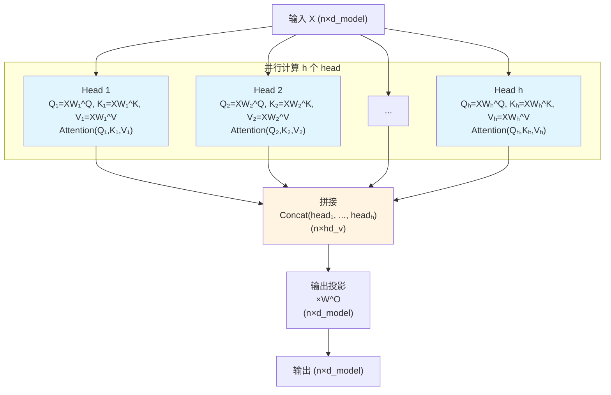

# 第04章：Multi-Head Attention——八个头，八个视角，还是八份低秩分解？

> **论文链接**：[Attention Is All You Need](https://proceedings.neurips.cc/paper_files/paper/2017/file/3f5ee243547dee91fbd053c1c4a845aa-Paper.pdf) (Vaswani et al., NIPS 2017)  
> **本章对应**：Section 3.2.2, Section 3.2.3, Table 3 row (A)

## 核心困惑

为什么要用多个head？一个head不够吗？

第03章讲了Scaled Dot-Product Attention的数学原理。但原论文不是直接用一个Attention，而是用了**8个并行的Attention**，叫Multi-Head Attention。

这不是简单的"多跑几次"。8个head有各自的投影矩阵$W^Q, W^K, W^V$，最后再拼接起来。这个设计背后的动机是什么？

完整的Multi-Head Attention公式：
$$\text{MultiHead}(Q, K, V) = \text{Concat}(\text{head}_1, ..., \text{head}_h)W^O$$
$$\text{where } \text{head}_i = \text{Attention}(QW_i^Q, KW_i^K, VW_i^V)$$

为什么是8个head而不是1个或16个？这个选择有数学依据吗？

## 前置知识补给站

### 1. 矩阵的秩与低秩分解

**矩阵的秩**：矩阵的秩是其线性独立的行（或列）的最大数量。

**低秩分解**：将一个大矩阵分解为两个小矩阵的乘积。
$$A_{m \times n} = B_{m \times r} \cdot C_{r \times n}$$

其中$r < \min(m, n)$，$r$叫做秩。

**为什么要低秩分解**：
- 减少参数量：$mn$个参数变成$mr + rn$个
- 当$r \ll \min(m, n)$时，参数量大幅减少

### 2. 表示子空间

在$d$维空间中，一个$k$维子空间是所有可以用$k$个基向量线性组合表示的向量的集合。

**直观理解**：
- 1维子空间：一条直线
- 2维子空间：一个平面
- $k$维子空间：一个$k$维"超平面"

**为什么需要多个子空间**：不同的子空间可以捕捉不同的特征。

### 3. 并行计算的优势

在GPU上，多个小矩阵乘法可以并行计算，总时间接近单个大矩阵乘法。

**关键**：$h$个head的计算可以同时进行，不需要等待。

## 论文精读：Multi-Head Attention的设计

### 原论文的动机

**Section 3.2.2**：
> "Multi-head attention allows the model to jointly attend to information from different representation subspaces at different positions. With a single attention head, averaging inhibits this."

翻译成人话：
- 单个head会"平均"所有信息，丢失细节
- 多个head可以关注不同的"表示子空间"
- 每个head学习不同的模式

**但原论文没有详细解释"表示子空间"是什么意思**。我们来深入分析。

### Multi-Head Attention的完整公式

$$\begin{aligned}
\text{MultiHead}(Q, K, V) &= \text{Concat}(\text{head}_1, ..., \text{head}_h)W^O \\
\text{where } \text{head}_i &= \text{Attention}(QW_i^Q, KW_i^K, VW_i^V)
\end{aligned}$$

**参数矩阵**：
- $W_i^Q \in \mathbb{R}^{d_{model} \times d_k}$：Query投影矩阵
- $W_i^K \in \mathbb{R}^{d_{model} \times d_k}$：Key投影矩阵
- $W_i^V \in \mathbb{R}^{d_{model} \times d_v}$：Value投影矩阵
- $W^O \in \mathbb{R}^{hd_v \times d_{model}}$：输出投影矩阵

**维度设置**（原论文）：
- $d_{model} = 512$：模型维度
- $h = 8$：head数量
- $d_k = d_v = d_{model} / h = 64$：每个head的维度

### 为什么每个head的维度是$d_{model}/h$？

**关键洞察**：这样设计使得Multi-Head Attention的**总计算量**与Single-Head Attention相同。

**Single-Head Attention的计算量**：

在Single-Head Attention中，因为没有降维投影，Key和Value的维度就是$d_{model}$。因此：
- $QK^T$：$(n \times d_{model}) \times (d_{model} \times n) = O(n^2 d_{model})$
- Softmax：$O(n^2)$
- 乘以$V$：$(n \times n) \times (n \times d_{model}) = O(n^2 d_{model})$
- 总计：$O(n^2 d_{model})$

**Multi-Head Attention的计算量**（每个head）：
- $QW^Q$：$(n \times d_{model}) \times (d_{model} \times d_k) = O(n d_{model} d_k)$
- $(QW^Q)(KW^K)^T$：$(n \times d_k) \times (d_k \times n) = O(n^2 d_k)$
- Softmax：$O(n^2)$
- 乘以$VW^V$：$(n \times n) \times (n \times d_k) = O(n^2 d_k)$
- 单个head：$O(n d_{model} d_k + n^2 d_k)$

**$h$个head的总计算量**：
$$h \times O(n d_{model} d_k + n^2 d_k) = O(h n d_{model} d_k + h n^2 d_k)$$

如果$d_k = d_{model} / h$：
$$O(h n d_{model} \frac{d_{model}}{h} + h n^2 \frac{d_{model}}{h}) = O(n d_{model}^2 + n^2 d_{model})$$

**结论**：Multi-Head的总计算量与Single-Head相同！

这是一个精妙的设计：用相同的计算量，换取了多个"视角"。

## 第一性原理推导：Multi-Head作为低秩分解

### 视角1：表示子空间

每个head学习一个$d_k$维的子空间。

**Single-Head Attention**：
- 在$d_{model}$维空间中直接计算attention
- 所有信息混在一起

**Multi-Head Attention**：
- 每个head在$d_k$维子空间中计算attention
- $h$个子空间可以捕捉不同的模式

**数学表达**：
$$\begin{aligned}
\text{head}_i &= \text{Attention}(QW_i^Q, KW_i^K, VW_i^V) \\
&= \text{softmax}\left(\frac{(QW_i^Q)(KW_i^K)^T}{\sqrt{d_k}}\right)(VW_i^V)
\end{aligned}$$

$W_i^Q, W_i^K, W_i^V$定义了第$i$个子空间。

### 视角2：低秩分解

Multi-Head Attention可以理解为一种**低秩分解**。

**Single-Head Attention**：
$$\text{Attention}(Q, K, V) = \text{softmax}\left(\frac{QK^T}{\sqrt{d_{model}}}\right)V$$

其中$QK^T$是一个$n \times n$的attention矩阵，秩的上限是$d_{model}$。

**Multi-Head Attention的低秩分解视角**：

将$QK^T$分解为$h$个小矩阵的组合：
$$QK^T \approx \sum_{i=1}^h (QW_i^Q)(KW_i^K)^T$$

每个$(QW_i^Q)(KW_i^K)^T$的秩上限是$d_k$（因为$QW_i^Q$是$n \times d_k$矩阵）。

$h$个这样的矩阵组合后，总有效秩上限为$h \cdot d_k = d_{model}$。

**关键洞察**：
- 在计算量相同的前提下，Multi-Head通过低秩分解让模型能够并行地从多个低维子空间捕捉信息
- 每个head专注于一个$d_k$维子空间，$h$个head组合起来覆盖整个$d_{model}$维空间

### 视角3：集成学习

Multi-Head Attention类似于集成学习中的"多个弱学习器"。

- 每个head是一个"弱学习器"（只看$d_k$维）
- $h$个head组合起来形成"强学习器"

**类比**：
- Random Forest：多棵决策树投票
- Multi-Head Attention：多个attention head拼接

## 消融实验解读：Table 3 row (A)

**原论文Table 3 row (A)**：

| $h$ | $d_k$ | $d_v$ | PPL (dev) | BLEU (dev) | 参数量 |
|:---|:---|:---|:----------|:-----------|:-------|
| 1 | 512 | 512 | 5.29 | 24.9 | 65M |
| 4 | 128 | 128 | 5.00 | 25.5 | 65M |
| 8 (base) | 64 | 64 | 4.92 | 25.8 | 65M |
| 16 | 32 | 32 | 4.91 | 25.8 | 65M |
| 32 | 16 | 16 | 5.01 | 25.4 | 65M |

**关键观察**：

1. **$h=1$最差**：PPL 5.29，BLEU 24.9
   - 单个head无法捕捉多样化的模式
   - 验证了Multi-Head的必要性

2. **$h=8$和$h=16$效果相当**：PPL 4.92 vs 4.91，BLEU 25.8 vs 25.8
   - 8个head已经足够
   - 继续增加head收益递减

3. **$h=32$效果下降**：PPL 5.01，BLEU 25.4
   - 每个head只有16维，表示能力太弱
   - 过度分割反而有害

4. **参数量相同**：所有配置都是65M参数
   - 因为$h \times d_k = d_{model}$保持不变
   - 这是一个公平的对比

**结论**：
- $h=8$是一个"甜蜜点"：既有足够的多样性，又不会过度分割
- $d_k=64$是一个合理的子空间维度

## 三种Attention的Multi-Head实现对比

在第02章我们讲了三种Attention的Q/K/V来源不同。现在我们看看它们在Multi-Head中的实现。

### 对比表格

| Attention类型 | Q投影 | K投影 | V投影 | 每个head的操作 |
|:-------------|:------|:------|:------|:--------------|
| **Encoder Self-Attention** | $X W_i^Q$ | $X W_i^K$ | $X W_i^V$ | $\text{Attention}(X W_i^Q, X W_i^K, X W_i^V)$ |
| **Decoder Masked Self-Attention** | $Y W_i^Q$ | $Y W_i^K$ | $Y W_i^V$ | $\text{Attention}(Y W_i^Q, Y W_i^K, Y W_i^V, \text{mask})$ |
| **Decoder Cross-Attention** | $Y W_i^Q$ | $Z W_i^K$ | $Z W_i^V$ | $\text{Attention}(Y W_i^Q, Z W_i^K, Z W_i^V)$ |

**关键区别**：
- Self-Attention：Q/K/V都投影自同一个输入（$X$或$Y$）
- Cross-Attention：Q投影自Decoder（$Y$），K/V投影自Encoder（$Z$）

**统一性**：
- 三种Attention都用同一个Multi-Head框架
- 只是输入来源不同

## Multi-Head Attention的完整计算流程

![Diagram 1](https://mermaid.ink/img/Z3JhcGggVEIKICAgIElucHV0WyLovpPlhaUgWCAobsOXZF9tb2RlbCkiXQogICAgCiAgICBzdWJncmFwaCAi5bm26KGM6K6h566XIGgg5LiqIGhlYWQiCiAgICAgICAgSDFbIkhlYWQgMTxici8-UeKCgT1YV-KCgV5RLCBL4oKBPVhX4oKBXkssIFbigoE9WFfigoFeVjxici8-QXR0ZW50aW9uKFHigoEsS-KCgSxW4oKBKSJdCiAgICAgICAgSDJbIkhlYWQgMjxici8-UeKCgj1YV-KCgl5RLCBL4oKCPVhX4oKCXkssIFbigoI9WFfigoJeVjxici8-QXR0ZW50aW9uKFHigoIsS-KCgixW4oKCKSJdCiAgICAgICAgSDNbIi4uLiJdCiAgICAgICAgSDhbIkhlYWQgaDxici8-UeKClT1YV-KClV5RLCBL4oKVPVhX4oKVXkssIFbigpU9WFfigpVeVjxici8-QXR0ZW50aW9uKFHigpUsS-KClSxW4oKVKSJdCiAgICBlbmQKICAgIAogICAgQ29uY2F0WyLmi7zmjqU8YnIvPkNvbmNhdChoZWFk4oKBLCAuLi4sIGhlYWTigpUpPGJyLz4obsOXaGRfdikiXQogICAgCiAgICBQcm9qZWN0WyLovpPlh7rmipXlvbE8YnIvPsOXV15PPGJyLz4obsOXZF9tb2RlbCkiXQogICAgCiAgICBPdXRwdXRbIui-k-WHuiAobsOXZF9tb2RlbCkiXQogICAgCiAgICBJbnB1dCAtLT4gSDEKICAgIElucHV0IC0tPiBIMgogICAgSW5wdXQgLS0-IEgzCiAgICBJbnB1dCAtLT4gSDgKICAgIAogICAgSDEgLS0-IENvbmNhdAogICAgSDIgLS0-IENvbmNhdAogICAgSDMgLS0-IENvbmNhdAogICAgSDggLS0-IENvbmNhdAogICAgCiAgICBDb25jYXQgLS0-IFByb2plY3QKICAgIFByb2plY3QgLS0-IE91dHB1dAogICAgCiAgICBzdHlsZSBIMSBmaWxsOiNlMWY1ZmYKICAgIHN0eWxlIEgyIGZpbGw6I2UxZjVmZgogICAgc3R5bGUgSDggZmlsbDojZTFmNWZmCiAgICBzdHlsZSBDb25jYXQgZmlsbDojZmZmNGUx)

查看Mermaid源码

**关键步骤**：
1. **并行投影**：每个head独立计算$QW_i^Q, KW_i^K, VW_i^V$
2. **并行Attention**：每个head独立计算Scaled Dot-Product Attention
3. **拼接**：将$h$个head的输出拼接成一个大向量
4. **输出投影**：用$W^O$将拼接后的向量投影回$d_{model}$维

## Head剪枝：哪些head可以被安全移除？

后续研究（Michel et al., "Are Sixteen Heads Really Better than One?", NeurIPS 2019）发现：**很多head是冗余的**。

**Table 3 row (A)已经暗示了冗余**：$h=16$和$h=8$效果几乎相同（BLEU都是25.8），说明多出来的8个head没有学到新东西。这为后续的head剪枝研究提供了实验依据。

### 实验发现

1. **大部分head可以被移除**：
   - 在某些任务上，移除50%的head，性能几乎不变
   - 甚至有些层只需要1个head

2. **不同head学到了不同的模式**：
   - 有些head关注局部信息（相邻位置）
   - 有些head关注长距离依赖
   - 有些head关注特定的语法结构（如主谓关系）

3. **head的重要性因层而异**：
   - 浅层：head更冗余
   - 深层：head更专业化

### 为什么会有冗余？

**可能的原因**：
1. **过参数化**：模型参数量远大于任务需要
2. **训练动态**：某些head在训练早期有用，后期被其他head替代
3. **集成效应**：多个head提供了"保险"，即使某些head失效，其他head仍能工作

**工程启示**：
- 可以用head剪枝来压缩模型
- 但原论文的$h=8$是一个保守的选择，确保了鲁棒性

## 2026年的批判性视角

### 1. 原论文没有深入分析head学到了什么

**原论文的局限**：
- 只给了消融实验（Table 3 row A）
- 没有可视化不同head的attention pattern
- 没有解释为什么$h=8$是最优的

**后续研究的发现**（Voita et al., "Analyzing Multi-Head Self-Attention", ACL 2019）：
- 不同head确实学到了不同的模式
- 但很多head是冗余的
- 可以用正则化来鼓励head的多样性

### 2. $h=8$是经验选择还是理论最优？

**原论文的选择**：$h=8, d_k=64$

**可能的理论依据**：
- $d_k=64$足够大，可以表示复杂的模式
- $h=8$足够多，可以捕捉多样性
- 但没有严格的数学证明

**后续模型的选择**：
- GPT-2：$h=12$（$d_{model}=768, d_k=64$）
- GPT-3：$h=96$（$d_{model}=12288, d_k=128$）
- 趋势：更大的模型用更多的head

### 3. Multi-Head vs Multi-Query Attention (MQA)

**Multi-Head Attention的问题**：
- 每个head都有独立的K和V
- 推理时需要缓存$h$份KV Cache
- 内存占用大

**Multi-Query Attention (MQA)**（Shazeer, 2019）：
- 所有head共享同一个K和V
- 只有Q是多头的
- KV Cache减少到原来的$1/h$

**Grouped-Query Attention (GQA)**（Ainslie et al., 2023）：
- MQA和Multi-Head的折中
- 将$h$个head分成$g$组，每组共享K和V
- LLaMA 2、Mistral等模型使用

### 4. Cross-Attention的K/V都来自Encoder

**原论文的设计**：Cross-Attention的K和V都来自Encoder输出。

**问题**：为什么不能K来自Encoder，V来自Decoder？

**答案**：
- Attention的机制是：用Q查询K，得到"应该关注Encoder的哪个位置"，然后用这个权重去V中提取信息
- K和V必须来自同一个地方，因为：
  1. Q-K的点积计算出"位置$i$应该关注Encoder的哪个位置$j$"
  2. 这个权重用于加权求和V，提取"位置$j$的信息"
  3. 如果V来自Decoder而K来自Encoder，那么Q-K计算出的是"应该关注Encoder的位置$j$"，但V提取的却是"Decoder的位置$j$的信息"——两者对不上
- 如果V来自Decoder，Cross-Attention就变成了另一种形式的Self-Attention，失去了"关注输入"的能力

**这是第02章面试题第4题的答案**。

## 面试追问清单

### ⭐ 基础必会

1. **为什么要用Multi-Head Attention而不是Single-Head？**
   - 提示：表示子空间、多样性

2. **Multi-Head Attention的计算复杂度是Single-Head的几倍？**
   - 提示：相同（因为$h \times d_k = d_{model}$）

3. **原论文为什么选择$h=8$？**
   - 提示：Table 3 row (A)的消融实验

### ⭐⭐ 进阶思考

4. **证明：Multi-Head Attention的总计算量与Single-Head Attention相同。**
   - 提示：展开矩阵乘法的复杂度，利用$d_k = d_{model}/h$

5. **如果$h=1$但$d_k=64$（而不是512），效果会怎样？**
   - 提示：参数量减少，表示能力下降

6. **为什么Table 3显示$h=32$效果反而下降？**
   - 提示：每个head只有16维，表示能力太弱

### ⭐⭐⭐ 专家领域

7. **Multi-Head Attention可以看作是什么数学结构的低秩分解？**
   - 提示：全维度attention矩阵的低秩近似

8. **如何设计一个实验来验证"不同head学到了不同的模式"？**
   - 提示：可视化attention pattern、head剪枝实验、正则化鼓励多样性

9. **Multi-Query Attention (MQA)和Multi-Head Attention有什么区别？为什么MQA可以减少KV Cache？**
   - 提示：MQA的所有head共享K和V，只有Q是多头的

---

**下一章预告**：第05章将深入拆解残差连接与Layer Normalization，回答"Pre-LN和Post-LN有什么区别？为什么GPT用Pre-LN？"

**论文原文传送门**：
- Transformer原论文：https://proceedings.neurips.cc/paper_files/paper/2017/file/3f5ee243547dee91fbd053c1c4a845aa-Paper.pdf
- 官方代码：https://github.com/tensorflow/tensor2tensor
