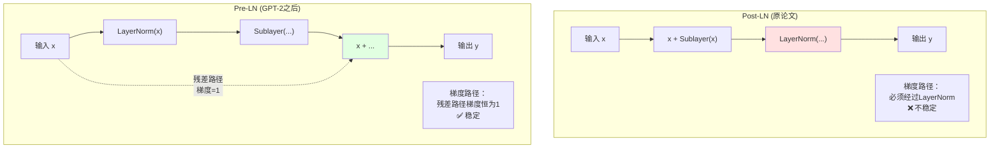

# 第05章：残差连接与Layer Normalization——Transformer的"高速公路"

> **论文链接**：[Attention Is All You Need](https://proceedings.neurips.cc/paper_files/paper/2017/file/3f5ee243547dee91fbd053c1c4a845aa-Paper.pdf) (Vaswani et al., NIPS 2017)  
> **本章对应**：Section 3.1, Figure 1

## 核心困惑

残差连接和LayerNorm各自解决什么问题？Pre-LN和Post-LN有什么区别？

前面四章讲了Attention机制，但Transformer不是简单地把Attention堆起来。每个子层后面都有两个关键组件：
1. **残差连接**（Residual Connection）：$x + \text{Sublayer}(x)$
2. **Layer Normalization**：$\text{LayerNorm}(...)$

原论文用的是**Post-LN**架构：
$$\text{LayerNorm}(x + \text{Sublayer}(x))$$

但GPT-2（2019）之后的模型几乎都改用**Pre-LN**：
$$x + \text{Sublayer}(\text{LayerNorm}(x))$$

为什么要改？Pre-LN比Post-LN好在哪？这背后有严格的数学推导。

## 前置知识补给站

### 1. 深度网络的梯度问题

在深度神经网络中，梯度通过链式法则反向传播：
$$\frac{\partial \mathcal{L}}{\partial x_1} = \frac{\partial \mathcal{L}}{\partial x_n} \cdot \frac{\partial x_n}{\partial x_{n-1}} \cdot ... \cdot \frac{\partial x_2}{\partial x_1}$$

**问题**：
- 如果每一步的梯度$< 1$，连乘后梯度消失
- 如果每一步的梯度$> 1$，连乘后梯度爆炸

这是为什么深度网络难以训练的根本原因。

### 2. 恒等映射（Identity Mapping）

恒等映射是指$f(x) = x$，即输出等于输入。

**为什么重要**：
- 恒等映射的梯度是1：$\frac{\partial f}{\partial x} = 1$
- 如果网络中有一条恒等路径，梯度可以无损传播

### 3. 归一化的作用

归一化是指将数据调整到某个标准分布（如均值0，方差1）。

**为什么需要归一化**：
- 防止数值过大或过小
- 加速训练收敛
- 提高模型稳定性

## 论文精读：Add & Norm的设计

### 原论文的架构

**Section 3.1**：
> "We employ a residual connection around each of the two sub-layers, followed by layer normalization. That is, the output of each sub-layer is LayerNorm(x + Sublayer(x))."

**关键信息**：
1. 每个子层都有残差连接
2. 残差连接后接LayerNorm
3. 这是**Post-LN**架构

### 残差连接的公式

$$y = x + \text{Sublayer}(x)$$

**直观理解**：
- $x$：输入（"高速公路"）
- $\text{Sublayer}(x)$：子层的输出（"辅路"）
- $y$：两者相加

**为什么叫"高速公路"**：
- 信息可以通过$x$直接传递，不经过$\text{Sublayer}$
- 即使$\text{Sublayer}$学不到东西（输出接近0），信息仍能传递

### Layer Normalization的公式

$$\text{LayerNorm}(x) = \gamma \cdot \frac{x - \mu}{\sigma} + \beta$$

其中：
- $\mu = \frac{1}{d}\sum_{i=1}^d x_i$：均值
- $\sigma = \sqrt{\frac{1}{d}\sum_{i=1}^d (x_i - \mu)^2}$：标准差
- $\gamma, \beta$：可学习的缩放和平移参数

**作用**：
- 将每个样本的特征归一化到均值0、方差1
- 然后用$\gamma, \beta$恢复表示能力

## 第一性原理推导：为什么Pre-LN更稳定

### Post-LN的梯度流分析

**Post-LN架构**（原论文）：
$$y = \text{LayerNorm}(x + \text{Sublayer}(x))$$

**反向传播**：
$$\frac{\partial \mathcal{L}}{\partial x} = \frac{\partial \mathcal{L}}{\partial y} \cdot \frac{\partial \text{LayerNorm}(x + \text{Sublayer}(x))}{\partial x}$$

**LayerNorm的梯度**：

设$z = x + \text{Sublayer}(x)$，则：
$$\text{LayerNorm}(z) = \gamma \cdot \frac{z - \mu}{\sigma} + \beta$$

梯度为：
$$\frac{\partial \text{LayerNorm}(z)}{\partial z_i} = \frac{\gamma}{\sigma} \left(1 - \frac{1}{d} - \frac{(z_i - \mu)^2}{\sigma^2 d}\right)$$

**关键问题**：
- 梯度依赖于$\sigma$（标准差）
- 在深层网络（N>12）中，$\sigma$的累积误差会导致梯度不稳定
- 当$\sigma$过大或过小时，梯度会爆炸或消失

**数值示例**（12层网络）：
- 假设每层的$\sigma$略大于1（如1.1）
- 12层累积后，梯度可能被放大$1.1^{12} \approx 3.14$倍
- 如果$\sigma$略小于1（如0.9），梯度被缩小$0.9^{12} \approx 0.28$倍

### Pre-LN的梯度流分析

**Pre-LN架构**（GPT-2之后）：
$$y = x + \text{Sublayer}(\text{LayerNorm}(x))$$

**反向传播**（详细展开）：

设$z = \text{LayerNorm}(x)$，则$y = x + \text{Sublayer}(z)$。

根据链式法则：
$$\frac{\partial y}{\partial x} = 1 + \frac{\partial \text{Sublayer}(z)}{\partial z} \cdot \frac{\partial z}{\partial x}$$

**关键洞察**：
1. **第一项$1$来自残差路径$x \to y$**：
   - 这是一条**恒等映射**，不经过任何非线性变换
   - 梯度恒为1，无论网络多深

2. **第二项经过子层和LayerNorm**：
   - $\frac{\partial \text{Sublayer}(z)}{\partial z}$：子层的梯度
   - $\frac{\partial z}{\partial x}$：LayerNorm的梯度（依赖于$\sigma$）
   - 这一项可能很小或很大

3. **在深层网络中，梯度主要通过残差路径传播**：
   - 即使第二项衰减到接近0，第一项的$1$仍能保证梯度不消失
   - 而在Post-LN中，**没有独立的残差路径**：LayerNorm包裹了整个$x + \text{Sublayer}(x)$，所有梯度都必须经过LayerNorm

**一句话总结**：
- **Post-LN**：所有梯度必须经过LayerNorm，$\sigma$的波动逐层累积，深层网络不稳定
- **Pre-LN**：梯度有两条路径——残差路径（梯度=1，稳定）和子层路径（经过LayerNorm）。梯度主要通过残差路径传播，因此稳定

**数值示例**（12层网络）：
- Post-LN：梯度需要经过12次LayerNorm，每次乘以一个与$\sigma$相关的系数
- Pre-LN：梯度可以通过残差路径直接传播，不受LayerNorm影响

### 对比图示

## LayerNorm vs BatchNorm

Transformer用LayerNorm而不是BatchNorm，为什么？

### BatchNorm的公式

$$\text{BatchNorm}(x_i) = \gamma \cdot \frac{x_i - \mu_B}{\sigma_B} + \beta$$

其中$\mu_B, \sigma_B$是**整个batch**的均值和标准差。

### LayerNorm的公式

$$\text{LayerNorm}(x_i) = \gamma \cdot \frac{x_i - \mu_L}{\sigma_L} + \beta$$

其中$\mu_L, \sigma_L$是**单个样本**的均值和标准差。

### 对比表格

| 特性 | BatchNorm | LayerNorm |
|:-----|:----------|:----------|
| **归一化维度** | 跨batch，同一特征 | 跨特征，单个样本 |
| **依赖batch大小** | 是（batch太小效果差） | 否（单样本独立） |
| **训练/推理一致性** | 否（推理用移动平均） | 是（完全一致） |
| **适用场景** | CNN（特征维度固定） | RNN/Transformer（序列长度可变） |

**为什么Transformer用LayerNorm**：
1. **序列长度可变**：不同样本的序列长度不同，BatchNorm难以处理
2. **推理稳定性**：LayerNorm在训练和推理时完全一致，不需要移动平均
3. **batch大小无关**：即使batch=1，LayerNorm仍然有效

## 消融实验：原论文没有对比Pre-LN和Post-LN

**原论文的局限**：
- 只使用了Post-LN
- 没有对比Pre-LN和Post-LN的实验
- 这是因为Pre-LN在2017年还没有被提出

**后续研究的发现**（Xiong et al., "On Layer Normalization in the Transformer Architecture", ICML 2020）：
- Pre-LN在训练深层模型（N>12）时更稳定
- Post-LN在某些任务上效果略好，但需要careful的学习率warmup
- GPT-3（N=96）必须使用Pre-LN，否则训练不稳定

## 2026年的批判性视角

### 1. 原论文的Post-LN在深层模型上的问题

**原论文的配置**：
- N=6层
- Post-LN架构

**问题**：
- 6层时Post-LN还能工作
- 但当N>12时，Post-LN容易出现梯度爆炸
- 这是为什么GPT-3（N=96）必须使用Pre-LN

**实验证据**（Xiong et al., 2020）：
- Post-LN在N=12时需要非常小的学习率和长时间的warmup
- Pre-LN在N=12时可以用更大的学习率，训练更快

### 2. Pre-LN的权衡

**Pre-LN的优势**：
- 训练更稳定
- 不需要careful的warmup
- 可以堆叠更多层

**Pre-LN的劣势**（Xiong et al., 2020）：
- 在某些任务上，最终效果略逊于Post-LN
- 原因：Post-LN的LayerNorm在最后，对输出有更强的约束

**现代模型的选择**：
- GPT-2/3/4：Pre-LN（因为层数多）
- BERT：Post-LN（因为只有12层）
- LLaMA：Pre-LN + RMSNorm（更简单的归一化）

### 3. RMSNorm：LayerNorm的简化版

**RMSNorm的公式**（Zhang & Sennrich, 2019）：
$$\text{RMSNorm}(x) = \gamma \cdot \frac{x}{\text{RMS}(x)}$$

其中$\text{RMS}(x) = \sqrt{\frac{1}{d}\sum_{i=1}^d x_i^2}$（均方根）。

**与LayerNorm的区别**：
- LayerNorm：减去均值，除以标准差
- RMSNorm：不减均值，只除以RMS

**为什么RMSNorm更好**：
- 计算更快（不需要计算均值）
- 效果相当（实验表明差异很小）
- LLaMA、Mistral等模型使用

### 4. 原论文没有讨论的问题

**残差连接的初始化**：
- 原论文没有讨论残差连接的初始化策略
- 后续研究（Fixup Initialization, 2019）提出了专门的初始化方法

**LayerNorm的位置**：
- 原论文只尝试了Post-LN
- 后续研究发现Pre-LN、Sandwich-LN等变体

**归一化的替代方案**：
- LayerNorm不是唯一选择
- RMSNorm、GroupNorm等变体

## 完整的数据流：Add & Norm在Transformer中的位置

```mermaid
graph TB
    subgraph Encoder["Encoder层"]
        E1["输入 x"]
        E2["Multi-Head<br/>Self-Attention"]
        E3["Add & Norm<br/>(Post-LN)"]
        E4["Feed Forward"]
        E5["Add & Norm<br/>(Post-LN)"]
        E6["输出"]
        
        E1 --> E2
        E2 --> E3
        E1 -.->|"残差"| E3
        E3 --> E4
        E4 --> E5
        E3 -.->|"残差"| E5
        E5 --> E6
    end
    
    subgraph Decoder["Decoder层"]
        D1["输入 y"]
        D2["Masked Multi-Head<br/>Self-Attention"]
        D3["Add & Norm"]
        D4["Cross-Attention"]
        D5["Add & Norm"]
        D6["Feed Forward"]
        D7["Add & Norm"]
        D8["输出"]
        
        D1 --> D2
        D2 --> D3
        D1 -.->|"残差"| D3
        D3 --> D4
        D4 --> D5
        D3 -.->|"残差"| D5
        D5 --> D6
        D6 --> D7
        D5 -.->|"残差"| D7
        D7 --> D8
    end
    
    style E3 fill:#fff4e1
    style E5 fill:#fff4e1
    style D3 fill:#fff4e1
    style D5 fill:#fff4e1
    style D7 fill:#fff4e1
```

**关键点**：
- Encoder每层有2个Add & Norm
- Decoder每层有3个Add & Norm
- 每个子层后都有残差连接和LayerNorm

## 面试追问清单

### ⭐ 基础必会

1. **残差连接解决什么问题？**
   - 提示：梯度消失、深度网络训练

2. **LayerNorm和BatchNorm有什么区别？为什么Transformer用LayerNorm？**
   - 提示：归一化维度、序列长度可变、推理一致性

3. **Pre-LN和Post-LN有什么区别？**
   - 提示：LayerNorm的位置、梯度流

### ⭐⭐ 进阶思考

4. **为什么Pre-LN比Post-LN更稳定？用梯度流分析。**
   - 提示：残差路径的梯度恒为1、不经过LayerNorm

5. **原论文用Post-LN，为什么GPT-2之后都改用Pre-LN？**
   - 提示：深层网络（N>12）的训练稳定性

6. **如果去掉残差连接，只保留LayerNorm，会怎样？**
   - 提示：梯度仍然会消失，深度网络无法训练

### ⭐⭐⭐ 专家领域

7. **证明：在Pre-LN架构中，残差路径的梯度恒为1。**
   - 提示：从反向传播的链式法则出发

8. **RMSNorm和LayerNorm有什么区别？为什么LLaMA用RMSNorm？**
   - 提示：不减均值、计算更快、效果相当

9. **如何设计一个比Pre-LN和Post-LN更好的归一化方案？**
   - 提示：Sandwich-LN、Adaptive LayerNorm、可学习的归一化位置

---

**下一章预告**：第06章将深入拆解Positional Encoding，回答"正弦波是如何教会模型'数数'的？为什么不直接学习位置编码？"

**论文原文传送门**：
- Transformer原论文：https://proceedings.neurips.cc/paper_files/paper/2017/file/3f5ee243547dee91fbd053c1c4a845aa-Paper.pdf
- 官方代码：https://github.com/tensorflow/tensor2tensor
