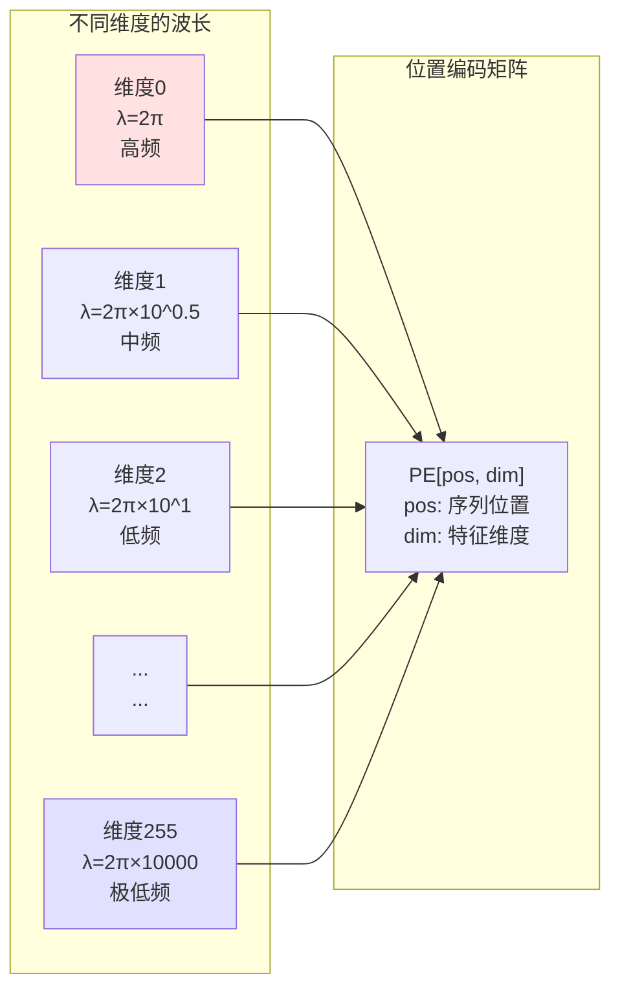

# 第06章：Positional Encoding——正弦波是如何教会模型"数数"的？

> **论文链接**：[Attention Is All You Need](https://proceedings.neurips.cc/paper_files/paper/2017/file/3f5ee243547dee91fbd053c1c4a845aa-Paper.pdf) (Vaswani et al., NIPS 2017)  
> **本章对应**：Section 3.5, Table 3 row (E)

## 核心困惑

为什么选择正弦函数？为什么不直接学习位置编码？

Self-Attention本身是**位置无关**的：$\text{Attention}(Q, K, V)$的计算不依赖位置信息。如果不加位置编码，模型无法区分"猫吃鱼"和"鱼吃猫"。

原论文用的是**sinusoidal位置编码**：
$$\begin{aligned}
PE_{(pos,2i)} &= \sin\left(\frac{pos}{10000^{2i/d_{model}}}\right) \\
PE_{(pos,2i+1)} &= \cos\left(\frac{pos}{10000^{2i/d_{model}}}\right)
\end{aligned}$$

为什么是正弦和余弦？为什么是10000这个常数？原论文说这样设计可以让模型"easily learn to attend by relative positions"，但没有严格证明。

## 前置知识补给站

### 1. 三角函数的和差公式

$$\begin{aligned}
\sin(\alpha + \beta) &= \sin\alpha \cos\beta + \cos\alpha \sin\beta \\
\cos(\alpha + \beta) &= \cos\alpha \cos\beta - \sin\alpha \sin\beta
\end{aligned}$$

**为什么重要**：这个公式可以用来表示相对位置。

### 2. 线性变换

如果$PE_{pos+k}$可以表示为$PE_{pos}$的线性组合，那么模型可以通过学习一个线性变换来捕捉相对位置关系。

### 3. 外推性（Extrapolation）

外推是指模型在训练时见过长度为$n$的序列，推理时能处理长度$> n$的序列。

## 论文精读：Sinusoidal位置编码的设计

### 原论文的公式

**Section 3.5**：
> "Since our model contains no recurrence and no convolution, in order for the model to make use of the order of the sequence, we must inject some information about the relative or absolute position of the tokens in the sequence."

**位置编码公式**：
$$\begin{aligned}
PE_{(pos,2i)} &= \sin\left(\frac{pos}{10000^{2i/d_{model}}}\right) \\
PE_{(pos,2i+1)} &= \cos\left(\frac{pos}{10000^{2i/d_{model}}}\right)
\end{aligned}$$

**参数说明**：
- $pos$：位置（0, 1, 2, ...）
- $i$：维度索引（0, 1, ..., $d_{model}/2 - 1$）
- $2i, 2i+1$：偶数维度用sin，奇数维度用cos

### 为什么是正弦和余弦？

**原论文的假设**：
> "We chose this function because we hypothesized it would allow the model to easily learn to attend by relative positions, since for any fixed offset $k$, $PE_{pos+k}$ can be represented as a linear function of $PE_{pos}$."

翻译成人话：$PE_{pos+k}$可以表示为$PE_{pos}$的线性组合。

## 第一性原理推导：相对位置的线性表示

### 证明：$PE_{pos+k}$是$PE_{pos}$的线性函数

**目标**：证明存在矩阵$M_k$，使得$PE_{pos+k} = M_k \cdot PE_{pos}$。

**推导**（以偶数维度为例）：

$$\begin{aligned}
PE_{(pos+k,2i)} &= \sin\left(\frac{pos+k}{10000^{2i/d_{model}}}\right) \\
&= \sin\left(\frac{pos}{10000^{2i/d_{model}}} + \frac{k}{10000^{2i/d_{model}}}\right)
\end{aligned}$$

设$\omega_i = \frac{1}{10000^{2i/d_{model}}}$，则：
$$PE_{(pos+k,2i)} = \sin(pos \cdot \omega_i + k \cdot \omega_i)$$

利用三角恒等式：
$$\begin{aligned}
\sin(pos \cdot \omega_i + k \cdot \omega_i) &= \sin(pos \cdot \omega_i) \cos(k \cdot \omega_i) + \cos(pos \cdot \omega_i) \sin(k \cdot \omega_i) \\
&= PE_{(pos,2i)} \cos(k \cdot \omega_i) + PE_{(pos,2i+1)} \sin(k \cdot \omega_i)
\end{aligned}$$

同理，对于奇数维度：
$$PE_{(pos+k,2i+1)} = -PE_{(pos,2i)} \sin(k \cdot \omega_i) + PE_{(pos,2i+1)} \cos(k \cdot \omega_i)$$

**结论**：$PE_{pos+k}$可以表示为$PE_{pos}$的线性组合，系数只依赖于$k$（相对位置），不依赖于$pos$（绝对位置）。

**变换矩阵**（对于维度$2i$和$2i+1$）：
$$\begin{bmatrix}
PE_{(pos+k,2i)} \\
PE_{(pos+k,2i+1)}
\end{bmatrix} = \begin{bmatrix}
\cos(k \omega_i) & \sin(k \omega_i) \\
-\sin(k \omega_i) & \cos(k \omega_i)
\end{bmatrix} \begin{bmatrix}
PE_{(pos,2i)} \\
PE_{(pos,2i+1)}
\end{bmatrix}$$

这是一个**旋转矩阵**！

**关键洞察**：这个旋转矩阵揭示了Sinusoidal编码的数学本质——**位置变化等价于旋转**。位置$pos+k$的编码可以通过将位置$pos$的编码旋转$k\omega_i$弧度得到。

**重要限定**：这个线性变换是**分块对角**的——每对维度$(2i, 2i+1)$有自己的旋转矩阵，不同维度的旋转角度不同（因为$\omega_i$随$i$变化）。不存在一个全局的$M_k$对所有维度都一样。

**与RoPE的联系**：后面的RoPE（旋转位置编码）正是抓住了这个本质，将旋转从"输入层加法"搬到了"Attention的Q-K点积"中，让相对位置信息直接编码在attention score里。

### 为什么10000这个常数？

**波长的几何级数**：

对于维度$i$，波长为：
$$\lambda_i = 2\pi \cdot 10000^{2i/d_{model}}$$

- $i=0$：$\lambda_0 = 2\pi$（最短波长）
- $i=d_{model}/2-1$：$\lambda_{max} = 2\pi \cdot 10000$（最长波长）

**直观理解**：
- 低维度（$i$小）：高频，捕捉局部位置信息
- 高维度（$i$大）：低频，捕捉全局位置信息

**为什么是10000**：
- 最长波长$2\pi \cdot 10000 \approx 62832$
- 这意味着模型可以区分长度达到几万的序列
- 原论文的训练序列长度是几百到几千，10000提供了足够的余量

## 消融实验解读：Table 3 row (E)

**原论文Table 3 row (E)**：

| 位置编码类型 | PPL (dev) | BLEU (dev) |
|:------------|:----------|:-----------|
| Sinusoidal | 4.92 | 25.7 |
| Learned | 4.92 | 25.7 |

**关键观察**：
- Sinusoidal和Learned效果**几乎相同**
- 这验证了原论文的假设：sinusoidal编码已经足够好

**为什么选择Sinusoidal而不是Learned**：
1. **外推能力**：Sinusoidal可以处理比训练时更长的序列
2. **参数量**：Learned需要额外的参数（$n \times d_{model}$），Sinusoidal不需要
3. **泛化能力**：Sinusoidal是确定性的，不会过拟合

## 2026年的批判性视角

### 1. Sinusoidal编码的外推性能不佳

**原论文的假设**：
> "We chose the sinusoidal version because it may allow the model to extrapolate to sequence lengths longer than the ones encountered during training."

**实际情况**（Press et al., "Train Short, Test Long", ICLR 2022）：
- Sinusoidal编码在长度外推上表现**不如预期**
- 训练时长度512，推理时长度2048，性能显著下降

**原因**：
- 虽然$PE_{pos+k}$可以表示为$PE_{pos}$的线性组合，但模型需要**学习**这个线性变换
- 训练时没见过长序列，模型无法学到正确的变换

### 2. RoPE：旋转位置编码

**RoPE的核心思想**（Su et al., 2021）：
- 不是把位置编码加到输入上，而是**旋转Q和K**
- 直接在attention计算中引入相对位置信息

**RoPE的公式**：
$$q_m^{(i)} = q^{(i)} e^{im\theta}, \quad k_n^{(i)} = k^{(i)} e^{in\theta}$$

其中$\theta = 10000^{-2i/d}$。

**优势**：
- 相对位置信息直接编码在Q-K点积中
- 外推性能更好
- LLaMA、GPT-NeoX等模型使用

### 3. ALiBi：Attention with Linear Biases

**ALiBi的核心思想**（Press et al., 2022）：
- 不用位置编码，而是在attention score上加一个**线性偏置**
- $\text{score}_{ij} = q_i \cdot k_j - m \cdot |i - j|$

**优势**：
- 外推性能极好（训练512，推理可到几千）
- 实现简单
- BLOOM模型使用

### 4. 原论文没有讨论的问题

**绝对位置 vs 相对位置**：
- Sinusoidal编码是绝对位置编码（每个位置有固定的编码）
- 但原论文说它能帮助学习相对位置
- 这个假设缺乏实验验证

**10000的选择**：
- 为什么是10000而不是1000或100000？
- 原论文没有消融实验

## 位置编码的可视化

**直观理解**：
- 每个维度是一个不同频率的正弦波
- 低维度：快速振荡，捕捉局部位置差异
- 高维度：缓慢振荡，捕捉全局位置模式

## 面试追问清单

### ⭐ 基础必会

1. **为什么Transformer需要位置编码？**
   - 提示：Self-Attention是位置无关的

2. **Sinusoidal位置编码的公式是什么？**
   - 提示：偶数维度sin，奇数维度cos

3. **Sinusoidal和Learned位置编码有什么区别？**
   - 提示：参数量、外推能力

### ⭐⭐ 进阶思考

4. **证明：$PE_{pos+k}$可以表示为$PE_{pos}$的线性组合。**
   - 提示：三角恒等式

5. **为什么原论文选择Sinusoidal而不是Learned？**
   - 提示：外推能力、参数量、泛化能力

6. **10000这个常数有什么意义？**
   - 提示：最长波长、序列长度上限

### ⭐⭐⭐ 专家领域

7. **为什么Sinusoidal编码的外推性能不如预期？**
   - 提示：模型需要学习线性变换，但训练时没见过长序列

8. **RoPE和Sinusoidal编码有什么本质区别？**
   - 提示：加在输入 vs 旋转Q/K

9. **如何设计一个比Sinusoidal更好的位置编码方案？**
   - 提示：RoPE、ALiBi、可学习的相对位置编码

---

**下一章预告**：第07章将深入拆解FFN，回答"Transformer的'知识存储'藏在哪？为什么$d_{ff} = 4 \times d_{model}$？"

**论文原文传送门**：
- Transformer原论文：https://proceedings.neurips.cc/paper_files/paper/2017/file/3f5ee243547dee91fbd053c1c4a845aa-Paper.pdf
- 官方代码：https://github.com/tensorflow/tensor2tensor
