# 第07章：FFN——Transformer的"知识存储"藏在哪？

> **论文链接**：[Attention Is All You Need](https://proceedings.neurips.cc/paper_files/paper/2017/file/3f5ee243547dee91fbd053c1c4a845aa-Paper.pdf) (Vaswani et al., NIPS 2017)  
> **本章对应**：Section 3.3, Table 3 row (C)

## 核心困惑

FFN在Transformer中扮演什么角色？为什么$d_{ff} = 4 \times d_{model}$？

前面六章讲了Attention、残差连接、位置编码，但Transformer的每一层还有一个关键组件：**Feed-Forward Network (FFN)**。

FFN的结构很简单：
$$\text{FFN}(x) = \max(0, xW_1 + b_1)W_2 + b_2$$

两层全连接网络，中间用ReLU激活。但这个简单的结构占据了Transformer **2/3的参数量**。

原论文设置$d_{ff} = 2048 = 4 \times d_{model}$，为什么是4倍？FFN到底在做什么？

## 前置知识补给站

### 1. 全连接层（Fully Connected Layer）

全连接层是最基本的神经网络层：
$$y = Wx + b$$

**参数量**：$d_{in} \times d_{out} + d_{out}$

### 2. ReLU激活函数

$$\text{ReLU}(x) = \max(0, x)$$

**特点**：
- 非线性
- 计算简单
- 梯度不饱和（$x > 0$时梯度为1）

### 3. Position-wise的含义

"Position-wise"是指FFN对每个位置**独立**应用，不同位置之间不共享信息。

**数学表达**：
$$\text{FFN}(x_{pos}) = \max(0, x_{pos}W_1 + b_1)W_2 + b_2$$

每个位置$pos$的计算是独立的。

## 论文精读：FFN的设计

### 原论文的公式

**Section 3.3**：
> "In addition to attention sub-layers, each of the layers in our encoder and decoder contains a fully connected feed-forward network, which is applied to each position separately and identically. This consists of two linear transformations with a ReLU activation in between."

**FFN公式**：
$$\text{FFN}(x) = \max(0, xW_1 + b_1)W_2 + b_2$$

**参数设置**：
- $d_{model} = 512$：输入和输出维度
- $d_{ff} = 2048$：中间层维度
- $d_{ff} = 4 \times d_{model}$

### FFN的参数量

**单层FFN的参数量**：
- $W_1$：$d_{model} \times d_{ff} = 512 \times 2048 = 1,048,576$
- $b_1$：$d_{ff} = 2048$
- $W_2$：$d_{ff} \times d_{model} = 2048 \times 512 = 1,048,576$
- $b_2$：$d_{model} = 512$
- 总计：$\approx 2.1$M参数

**对比Multi-Head Attention的参数量**：
- $W^Q, W^K, W^V, W^O$：$4 \times d_{model}^2 = 4 \times 512^2 = 1,048,576$
- 总计：$\approx 1$M参数

**结论**：FFN的参数量是Attention的**2倍**。

**关键点**：FFN占据了Transformer **2/3的参数量**。

推导：
$$\frac{\text{FFN参数量}}{\text{总参数量}} = \frac{2 \times 512 \times 2048}{4 \times 512^2 + 2 \times 512 \times 2048} = \frac{2,097,152}{3,145,728} = \frac{2}{3}$$

### 为什么是Position-wise？

**Position-wise的含义**：
- FFN对每个位置独立应用
- 不同位置之间不共享信息
- 相当于kernel size=1的1D卷积

**为什么这样设计**：
- Attention已经负责位置之间的信息交互
- FFN负责对每个位置的表示进行非线性变换
- 分工明确：Attention做"通信"，FFN做"计算"

## 第一性原理推导：FFN作为Key-Value Memory

### 视角1：非线性变换

**最直观的理解**：FFN提供非线性变换能力。

Attention是线性的（加权求和），如果没有FFN，整个Transformer就是线性模型。

**数学表达**：
$$\text{Attention}(Q, K, V) = \text{softmax}(QK^T)V$$

这是线性的（softmax的输入是线性的，输出是加权求和）。

FFN的ReLU提供了非线性：
$$\text{ReLU}(xW_1 + b_1)$$

**为什么非线性是必须的**：如果没有ReLU，两层全连接等价于一层：
$$(xW_1)W_2 = x(W_1W_2)$$

$W_1W_2$仍然是一个线性变换。整个Transformer就变成线性模型，表达能力大幅下降。

### 视角2：Key-Value Memory（Geva et al., EMNLP 2021）

**核心洞察**：FFN可以看作是一个**Key-Value存储系统**。

**数学推导**：

将FFN展开：
$$\text{FFN}(x) = \max(0, xW_1 + b_1)W_2 + b_2$$

**为什么$W_1$的列是key**：$W_1$是$d_{model} \times d_{ff}$矩阵，$xW_1$的第$i$个分量是输入$x$与$W_1$第$i$列的内积。因此$W_1$的每一列可以理解为一个"key"——它定义了输入匹配什么模式时该神经元会被激活。

设$W_1$的第$i$列为$k_i$，$W_2$的第$i$行为$v_i$，则：
$$\text{FFN}(x) = \sum_{i=1}^{d_{ff}} \max(0, x \cdot k_i + b_{1,i}) \cdot v_i + b_2$$

**直观理解**：
- $k_i$：第$i$个"key"（查询模式）
- $x \cdot k_i$：输入$x$与key的匹配度
- $\max(0, x \cdot k_i + b_{1,i})$：激活强度
- $v_i$：第$i$个"value"（存储的知识）
- 输出：所有被激活的value的加权和

**类比**：
- Attention：从输入序列中检索信息
- FFN：从参数中检索知识

### 视角3：专家系统

每个神经元可以看作一个"专家"：
- 当输入匹配某个模式时，对应的专家被激活
- 不同专家存储不同的知识
- 最终输出是所有激活专家的组合

## 消融实验解读：Table 3 row (C)

**原论文Table 3 row (C)**（$d_{ff}$的消融实验）：

| $d_{ff}$ | PPL (dev) | BLEU (dev) | 参数量 | 解读 |
|:---------|:----------|:-----------|:-------|:-----|
| 1024 | 4.66 | **26.0** | 168M | **最优配置**，比base还好 |
| 2048 (base) | 4.92 | 25.8 | 65M | 原论文选择 |

**注意**：Table 3 row (C)同时包含了层数$N$和$d_{ff}$的变化。上表只展示$d_{ff}$的部分。

**关键发现**：
- $d_{ff}=1024$（$2 \times d_{model}$）时效果最好，BLEU达到26.0
- 原论文选择$d_{ff}=2048$（$4 \times d_{model}$）可能是为了平衡性能和参数量
- 这说明$d_{ff} = 4 \times d_{model}$不是理论最优，而是经验选择

## 2026年的批判性视角

### 1. FFN的作用直到2021年才被理论化

**原论文的局限**：
- 只说FFN是"fully connected feed-forward network"
- 没有深入分析FFN的作用
- $d_{ff} = 4 \times d_{model}$这个比例是经验选择，缺乏理论依据

**后续研究的发现**（Geva et al., EMNLP 2021）：
- FFN作为Key-Value Memory的理论
- 从理论上解释为什么FFN存储知识

### 2. GeLU替代ReLU

**原论文用ReLU**：
$$\text{ReLU}(x) = \max(0, x)$$

**现代模型用GeLU**（Gaussian Error Linear Unit）：
$$\text{GeLU}(x) = x \cdot \Phi(x)$$

其中$\Phi(x)$是标准正态分布的累积分布函数。

实践中常用近似公式：
$$\text{GeLU}(x) \approx 0.5x\left(1 + \tanh\left(\sqrt{\frac{2}{\pi}}(x + 0.044715x^3)\right)\right)$$

**为什么GeLU更好**：
- 更平滑（可微）
- 在负值区域有小的梯度（不是完全截断）
- BERT、GPT等模型使用

### 3. SwiGLU：GLU的变体

**GLU（Gated Linear Unit）**：
$$\text{GLU}(x) = (xW_1) \odot \sigma(xW_2)$$

**SwiGLU**（Shazeer, 2020）：
$$\text{SwiGLU}(x) = (xW_1) \odot \text{Swish}(xW_2)$$

其中$\text{Swish}(x) = x \cdot \sigma(x)$。

**优势**：
- 效果比ReLU和GeLU更好
- LLaMA、PaLM等模型使用

### 4. MoE：稀疏FFN

**标准FFN的问题**：
- 所有神经元都参与计算
- 计算量大

**MoE（Mixture of Experts）**：
- 将FFN分成多个"专家"
- 每次只激活部分专家
- 用更少的计算量撬动更大的参数量

详见第10章。

## FFN在Encoder和Decoder中的位置

```mermaid
graph TB
    subgraph Encoder["Encoder层"]
        E1["输入"]
        E2["Multi-Head<br/>Self-Attention"]
        E3["Add & Norm"]
        E4["FFN<br/>d_model→d_ff→d_model"]
        E5["Add & Norm"]
        E6["输出"]
        
        E1 --> E2
        E2 --> E3
        E1 -.->|"残差"| E3
        E3 --> E4
        E4 --> E5
        E3 -.->|"残差"| E5
        E5 --> E6
    end
    
    subgraph Decoder["Decoder层"]
        D1["输入"]
        D2["Masked<br/>Self-Attention"]
        D3["Add & Norm"]
        D4["Cross-Attention"]
        D5["Add & Norm"]
        D6["FFN<br/>d_model→d_ff→d_model"]
        D7["Add & Norm"]
        D8["输出"]
        
        D1 --> D2
        D2 --> D3
        D1 -.->|"残差"| D3
        D3 --> D4
        D4 --> D5
        D3 -.->|"残差"| D5
        D5 --> D6
        D6 --> D7
        D5 -.->|"残差"| D7
        D7 --> D8
    end
    
    style E4 fill:#fff4e1
    style D6 fill:#fff4e1
```

**关键点**：
- FFN在每个Attention子层之后
- Encoder每层有1个FFN
- Decoder每层有1个FFN
- FFN占据了模型参数的2/3

## 面试追问清单

### ⭐ 基础必会

1. **FFN的公式是什么？**
   - 提示：两层全连接，中间ReLU

2. **为什么FFN是Position-wise的？**
   - 提示：对每个位置独立应用

3. **FFN的参数量占Transformer的多少？**
   - 提示：约2/3

### ⭐⭐ 进阶思考

4. **为什么$d_{ff} = 4 \times d_{model}$？**
   - 提示：经验选择，Table 3显示$2 \times d_{model}$可能更好

5. **FFN在Transformer中扮演什么角色？**
   - 提示：非线性变换、Key-Value Memory

6. **如果去掉FFN，只保留Attention，会怎样？**
   - 提示：模型变成线性的，表达能力大幅下降

### ⭐⭐⭐ 专家领域

7. **如何从Key-Value Memory的角度理解FFN？**
   - 提示：$W_1$的列是key，$W_2$的行是value

8. **GeLU和ReLU有什么区别？为什么现代模型用GeLU？**
   - 提示：平滑性、负值区域的梯度

9. **如何用MoE来扩展FFN的容量？**
   - 提示：稀疏激活、专家路由

---

**下一章预告**：第08章将深入拆解训练技巧，回答"为什么Transformer需要学习率warmup？Label Smoothing为什么有效？"

**论文原文传送门**：
- Transformer原论文：https://proceedings.neurips.cc/paper_files/paper/2017/file/3f5ee243547dee91fbd053c1c4a845aa-Paper.pdf
- 官方代码：https://github.com/tensorflow/tensor2tensor
