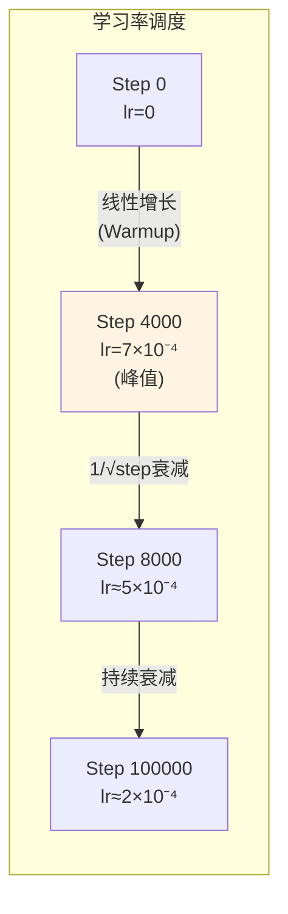

# 第08章：训练的艺术——Warmup、Label Smoothing与Adam的共谋

> **论文链接**：[Attention Is All You Need](https://proceedings.neurips.cc/paper_files/paper/2017/file/3f5ee243547dee91fbd053c1c4a845aa-Paper.pdf) (Vaswani et al., NIPS 2017)  
> **本章对应**：Section 5.3 (Optimizer), Section 5.4 (Regularization)

## 核心困惑

为什么Transformer需要学习率warmup？Label Smoothing为什么有效？

前面七章讲了Transformer的架构设计，但一个好的架构还需要好的训练策略。原论文用了几个关键的训练技巧：
1. **Adam优化器**：$\beta_1=0.9, \beta_2=0.98$
2. **学习率warmup**：前4000步线性增长，之后按$1/\sqrt{step}$衰减
3. **Label Smoothing**：$\epsilon_{ls}=0.1$

这些技巧不是随便选的，每一个都有数学动机。

## 前置知识补给站

### 1. 梯度下降与学习率

梯度下降的更新公式：
$$\theta_{t+1} = \theta_t - \eta \nabla_\theta \mathcal{L}$$

**学习率$\eta$的作用**：
- 太大：训练不稳定，可能发散
- 太小：训练太慢，可能陷入局部最优

### 2. 动量（Momentum）

动量是指利用历史梯度信息：
$$v_t = \beta v_{t-1} + \nabla_\theta \mathcal{L}$$
$$\theta_{t+1} = \theta_t - \eta v_t$$

**作用**：
- 加速收敛
- 减少震荡

### 3. 自适应学习率

不同参数可能需要不同的学习率。自适应优化器（如Adam）为每个参数维护独立的学习率。

## 论文精读：Adam优化器

### Adam的公式

**Section 5.3**：
> "We used the Adam optimizer with $\beta_1 = 0.9$, $\beta_2 = 0.98$ and $\epsilon = 10^{-9}$."

**Adam的完整公式**：
$$\begin{aligned}
m_t &= \beta_1 m_{t-1} + (1 - \beta_1) g_t \quad \text{(一阶矩估计)} \\
v_t &= \beta_2 v_{t-1} + (1 - \beta_2) g_t^2 \quad \text{(二阶矩估计)} \\
\hat{m}_t &= \frac{m_t}{1 - \beta_1^t} \quad \text{(偏差修正)} \\
\hat{v}_t &= \frac{v_t}{1 - \beta_2^t} \quad \text{(偏差修正)} \\
\theta_{t+1} &= \theta_t - \eta \frac{\hat{m}_t}{\sqrt{\hat{v}_t} + \epsilon}
\end{aligned}$$

**参数说明**：
- $g_t = \nabla_\theta \mathcal{L}$：当前梯度
- $m_t$：梯度的指数移动平均（一阶矩）
- $v_t$：梯度平方的指数移动平均（二阶矩）
- $\beta_1, \beta_2$：衰减率
- $\epsilon$：数值稳定性常数

### 为什么$\beta_2 = 0.98$而不是0.999？

**标准Adam**：$\beta_2 = 0.999$

**Transformer**：$\beta_2 = 0.98$

**区别**：
- $\beta_2$越大，二阶矩估计越"长记忆"
- $\beta_2 = 0.98$意味着对梯度二阶矩的估计更"激进"

**从半衰期角度理解**：
- $\beta_2=0.999$的半衰期：$\log 0.5 / \log 0.999 \approx 692$步
- $\beta_2=0.98$的半衰期：$\log 0.5 / \log 0.98 \approx 34$步
- 两者的"记忆窗口"相差20倍

**可能的原因**：
- Transformer的梯度分布变化较快
- 更小的$\beta_2$让优化器更快适应梯度变化
- 短窗口更适合快速变化的梯度分布

## 第一性原理推导：学习率Warmup

### 学习率调度公式

**Section 5.3**：
$$lrate = d_{model}^{-0.5} \cdot \min(step\_num^{-0.5}, step\_num \cdot warmup\_steps^{-1.5})$$

**参数设置**：
- $d_{model} = 512$
- $warmup\_steps = 4000$

### 公式解读

**分段函数**：
$$lrate = d_{model}^{-0.5} \cdot \begin{cases}
step\_num \cdot warmup\_steps^{-1.5} & \text{if } step\_num < warmup\_steps \\
step\_num^{-0.5} & \text{if } step\_num \geq warmup\_steps
\end{cases}$$

**第一阶段**（前4000步）：
$$lrate = d_{model}^{-0.5} \cdot step\_num \cdot warmup\_steps^{-1.5}$$

这是一个**线性增长**的函数：
$$lrate = \frac{step\_num}{d_{model}^{0.5} \cdot warmup\_steps^{1.5}}$$

**第二阶段**（4000步之后）：
$$lrate = d_{model}^{-0.5} \cdot step\_num^{-0.5} = \frac{1}{\sqrt{d_{model}} \cdot \sqrt{step\_num}}$$

这是一个**inverse square root衰减**。

### 峰值学习率

在$step\_num = warmup\_steps = 4000$时，学习率达到峰值：
$$lrate_{peak} = d_{model}^{-0.5} \cdot warmup\_steps^{-0.5}$$

代入数值：
$$\begin{aligned}
lrate_{peak} &= 512^{-0.5} \cdot 4000^{-0.5} \\
&= \frac{1}{\sqrt{512}} \cdot \frac{1}{\sqrt{4000}} \\
&= \frac{1}{22.6} \cdot \frac{1}{63.2} \\
&\approx 0.044 \cdot 0.0158 \\
&\approx 7 \times 10^{-4}
\end{aligned}$$

### 为什么需要Warmup？

**问题**：如果一开始就用大学习率会怎样？

**答案**：训练不稳定，可能发散。

**原因**：
1. **参数初始化**：模型参数是随机初始化的，梯度分布不稳定
2. **Adam的二阶矩估计**：训练初期，$v_t$（梯度平方的移动平均）还没有准确估计
3. **归一化层的输入分布不稳定**：训练初期，模型参数的分布剧烈变化，导致LayerNorm的输入分布不稳定。LayerNorm的$\gamma$和$\beta$参数（可学习的缩放和平移）需要时间来适应这个变化

**Warmup的作用**：
- 让模型在训练初期"慢慢来"
- 给Adam的二阶矩估计足够的时间收敛
- 让归一化层的输入分布逐渐稳定

**注**：原论文用的是Post-LN架构（见第05章）。Post-LN的梯度流不稳定，Warmup是缓解这个问题的手段之一。后续模型改用Pre-LN后，对Warmup的依赖大大降低——有些Pre-LN模型甚至不需要Warmup。

### 学习率曲线可视化

查看Mermaid源码

## Label Smoothing：让模型"不那么自信"

### Label Smoothing的公式

**Section 5.4**：
> "During training, we employed label smoothing of value $\epsilon_{ls} = 0.1$. This hurts perplexity, as the model learns to be more unsure, but improves accuracy and BLEU score."

**标准的交叉熵损失**：
$$\mathcal{L} = -\sum_{k=1}^K y_k \log p_k$$

其中$y_k$是one-hot标签（正确类别为1，其他为0）。

**Label Smoothing**：
$$y_k^{smooth} = \begin{cases}
1 - \epsilon_{ls} & \text{if } k = \text{correct class} \\
\frac{\epsilon_{ls}}{K - 1} & \text{otherwise}
\end{cases}$$

**原论文设置**：$\epsilon_{ls} = 0.1$

### 为什么Label Smoothing有效？

**视角1：正则化**

Label Smoothing防止模型过度自信。

**标准训练**：模型会尽量让正确类别的概率接近1，其他类别接近0。

**Label Smoothing**：模型被鼓励给错误类别分配一些小概率。

**效果**：
- 防止过拟合
- 提高泛化能力

**视角2：熵正则化**

Label Smoothing等价于在损失函数中加入熵正则项：
$$\mathcal{L}_{smooth} = \mathcal{L}_{CE} - \epsilon_{ls} \cdot H(p)$$

其中$H(p) = -\sum_k p_k \log p_k$是输出分布的熵。

**直观理解**：鼓励模型的输出分布有更高的熵（更"不确定"）。

### Label Smoothing的权衡

**原论文的观察**：
> "This hurts perplexity, as the model learns to be more unsure, but improves accuracy and BLEU score."

**Perplexity vs BLEU**：
- Perplexity衡量模型的"确定性"（越低越好）
- BLEU衡量翻译质量（越高越好）

**Label Smoothing的效果**：
- Perplexity变差（模型更"不确定"）
- BLEU变好（翻译质量提高）

**结论**：过度自信不一定是好事。

## Dropout：随机失活

**Section 5.4**：
> "We apply dropout to the output of each sub-layer, before it is added to the sub-layer input and normalized. In addition, we apply dropout to the sums of the embeddings and the positional encodings in both the encoder and decoder stacks. For the base model, we use a rate of $P_{drop} = 0.1$."

**Dropout的位置**（关键细节）：
$$\text{LayerNorm}(x + \text{Dropout}(\text{Sublayer}(x)))$$

Dropout作用于子层输出，**在残差加和之前**。这样残差路径（$x$）不受Dropout影响，只有子层的贡献被随机屏蔽。

**具体位置**：
1. 每个子层的输出（Attention、FFN）→ 在Add之前
2. Embedding + Positional Encoding → 输入Encoder/Decoder之前

**Dropout率**：$P_{drop} = 0.1$

**注**：Base模型使用$P_{drop}=0.1$。Big模型在不同任务上使用不同的Dropout率（EN-DE任务可能使用0.3，EN-FR任务使用0.1）——更大的模型需要更强的正则化。

**作用**：
- 防止过拟合
- 相当于集成学习（训练时随机dropout，推理时用全部神经元）

## 2026年的批判性视角

### 1. Warmup的理论解释

**原论文的局限**：
- Warmup是经验性的，缺乏理论解释
- 为什么是4000步而不是2000或8000？

**后续研究的发现**（Zhang et al., "Why Gradient Clipping Accelerates Training", NeurIPS 2020）：
- Warmup的作用是控制训练初期的梯度范数
- 从梯度范数的角度给出了理论依据

### 2. Label Smoothing的适用性

**原论文的发现**：Label Smoothing在翻译任务上有效。

**后续研究的发现**（Müller et al., "When Does Label Smoothing Help?", NeurIPS 2019）：
- Label Smoothing在某些任务上反而降低性能
- 特别是在类别不平衡的任务上

**结论**：Label Smoothing不是万能的，需要根据任务调整。

### 3. 学习率调度的替代方案

**原论文的调度**：Warmup + Inverse Square Root Decay

**现代模型的选择**：
- **Cosine Annealing**：学习率按余弦函数衰减
- **Linear Decay**：学习率线性衰减到0
- **Constant with Warmup**：Warmup后保持恒定

**GPT-3的选择**：Cosine Annealing with Warmup

### 4. AdamW：Adam的改进

**Adam的问题**：权重衰减（weight decay）的实现不正确。

**AdamW**（Loshchilov & Hutter, 2019）：
- 修正了权重衰减的实现
- 效果比Adam更好
- 现代模型（GPT、BERT）使用

## 训练配置总结

| 配置项 | 值 | 说明 |
|:------|:---|:-----|
| **优化器** | Adam | $\beta_1=0.9, \beta_2=0.98, \epsilon=10^{-9}$ |
| **学习率调度** | Warmup + Inverse Sqrt | Warmup 4000步，峰值$7 \times 10^{-4}$ |
| **Dropout** | 0.1 | 应用于子层输出和embedding |
| **Label Smoothing** | 0.1 | 防止过度自信 |
| **Batch Size** | ~25000 tokens | 每个batch约25000个token |
| **训练步数** | 100K (base) / 300K (big) | Base模型12小时，Big模型3.5天 |

## 面试追问清单

### ⭐ 基础必会

1. **为什么Transformer需要学习率warmup？**
   - 提示：训练初期梯度不稳定、Adam的二阶矩估计

2. **Label Smoothing是什么？为什么有效？**
   - 提示：防止过度自信、正则化

3. **Adam优化器的$\beta_1$和$\beta_2$分别控制什么？**
   - 提示：一阶矩（梯度）和二阶矩（梯度平方）

### ⭐⭐ 进阶思考

4. **计算Transformer的峰值学习率。**
   - 提示：$d_{model}^{-0.5} \cdot warmup\_steps^{-0.5}$

5. **为什么原论文的$\beta_2 = 0.98$而不是标准的0.999？**
   - 提示：更快适应梯度变化

6. **Label Smoothing为什么会"hurt perplexity"但"improve BLEU"？**
   - 提示：模型更不确定，但泛化能力更强

### ⭐⭐⭐ 专家领域

7. **从梯度范数的角度解释为什么需要warmup。**
   - 提示：训练初期梯度范数很大，需要小学习率控制

8. **AdamW和Adam有什么区别？为什么AdamW更好？**
   - 提示：权重衰减的实现方式

9. **如何设计一个比原论文更好的学习率调度策略？**
   - 提示：Cosine Annealing、Linear Decay、根据验证集动态调整

---

**第一部分完结**：前8章完成了原论文的硬核拆解。第09-11章将分析现代架构的演进（Decoder-only、MoE、长文本）。

**论文原文传送门**：
- Transformer原论文：https://proceedings.neurips.cc/paper_files/paper/2017/file/3f5ee243547dee91fbd053c1c4a845aa-Paper.pdf
- 官方代码：https://github.com/tensorflow/tensor2tensor
