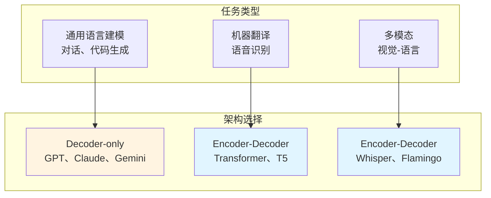

# 第09章：架构选择的分野——Decoder-only为什么赢了通用语言建模？

> **论文链接**：[Attention Is All You Need](https://proceedings.neurips.cc/paper_files/paper/2017/file/3f5ee243547dee91fbd053c1c4a845aa-Paper.pdf) (Vaswani et al., NIPS 2017)  
> **本章对应**：原论文的Encoder-Decoder架构（作为对比基准）

## 核心困惑

为什么GPT、Claude、Gemini都选择Decoder-only架构？Encoder-Decoder架构死了吗？

原论文的Transformer是Encoder-Decoder架构，专为机器翻译设计。但2018年之后，语言建模领域出现了分野：
- **BERT（2018）**：只用Encoder
- **GPT（2018-2024）**：只用Decoder
- **T5（2019）**：继续用Encoder-Decoder

到了2024年，几乎所有的大语言模型（GPT-4、Claude、Gemini、LLaMA）都选择了Decoder-only。

这是为什么？Encoder-Decoder架构真的过时了吗？

## 前置知识补给站

### 1. 三种架构的定义

**Encoder-Decoder**（原论文）：
- Encoder：处理输入序列，输出上下文表示
- Decoder：根据Encoder输出，自回归生成目标序列
- 用途：机器翻译、语音识别

**Encoder-only**（BERT）：
- 只有Encoder，没有Decoder
- 双向注意力：每个token可以看到所有其他token
- 用途：文本分类、命名实体识别、问答

**Decoder-only**（GPT）：
- 只有Decoder，没有Encoder
- 单向注意力：每个token只能看到之前的token（因果mask）
- 用途：文本生成、对话、代码生成

### 2. 自回归 vs 自编码

**自回归（Autoregressive）**：
- 训练目标：预测下一个token
- 公式：$P(x_1, ..., x_n) = \prod_{i=1}^n P(x_i | x_1, ..., x_{i-1})$
- 代表：GPT

**自编码（Autoencoding）**：
- 训练目标：重建被mask的token
- 公式：给定$x_1, [MASK], x_3, ..., x_n$，预测$x_2$
- 代表：BERT

**为什么BERT不能直接用于生成**：
- BERT的Masked LM假设被mask的位置相互独立
- 要生成文本，需要知道"要生成多少个token"，然后一次性预测所有位置——这不现实
- GPT的自回归生成每次只预测一个token，天然适合生成任务

### 3. 训练目标的区别

| 架构 | 训练目标 | 输入 | 输出 | 注意力类型 |
|:-----|:---------|:-----|:-----|:-----------|
| Encoder-Decoder | 条件生成 | 源序列 | 目标序列 | Encoder双向，Decoder单向 |
| Encoder-only | Masked LM | 带mask的序列 | 重建原序列 | 双向 |
| Decoder-only | Next token prediction | 前缀 | 下一个token | 单向（因果） |

## 三种架构的数据流对比

```mermaid
graph TB
    subgraph ED["Encoder-Decoder (原论文)"]
        ED1["输入序列<br/>源语言"]
        ED2["Encoder<br/>双向Self-Attention"]
        ED3["上下文表示"]
        ED4["Decoder<br/>Masked Self-Attention<br/>+ Cross-Attention"]
        ED5["输出序列<br/>目标语言"]
        
        ED1 --> ED2
        ED2 --> ED3
        ED3 --> ED4
        ED4 --> ED5
    end
    
    subgraph EO["Encoder-only (BERT)"]
        EO1["输入序列<br/>[MASK]标记"]
        EO2["Encoder<br/>双向Self-Attention"]
        EO3["预测[MASK]"]
        
        EO1 --> EO2
        EO2 --> EO3
    end
    
    subgraph DO["Decoder-only (GPT)"]
        DO1["输入序列<br/>前缀 (The cat sat on the)"]
        DO2["Decoder<br/>Masked Self-Attention"]
        DO3["预测下一个token<br/>(cat, sat, on, the, mat)"]
        
        DO1 --> DO2
        DO2 --> DO3
        DO2 -.->|"自回归循环"| DO1
    end
    
    style ED2 fill:#e1f5ff
    style ED4 fill:#fff4e1
    style EO2 fill:#e1f5ff
    style DO2 fill:#fff4e1
```

## 为什么Decoder-only在通用语言建模中胜出？

### 1. 训练目标的统一性

**Encoder-Decoder的问题**：
- 需要成对的数据（源序列 → 目标序列）
- 机器翻译有这样的数据（英语 → 法语）
- 但通用语言建模没有明确的"源"和"目标"

**Decoder-only的优势**：
- 训练目标统一：next token prediction
- 任何文本都可以用：给定前缀，预测下一个token
- 互联网文本是连续的，天然适合自回归训练

**GPT-2论文的选择**（Radford et al., 2019）：
> GPT-2选择Decoder-only架构，核心理由是：语言建模任务本身是自回归的（给定前缀预测下一个token），Decoder-only的因果mask天然匹配这个任务。

**数学表达**：

Decoder-only的训练目标：
$$\mathcal{L} = -\sum_{i=1}^n \log P(x_i | x_1, ..., x_{i-1})$$

这个目标可以应用于任何文本，不需要成对数据。

### 2. 架构的简洁性

**Encoder-Decoder的复杂性**：
- 两个子网络：Encoder + Decoder
- 三种Attention：Encoder Self-Attention、Decoder Masked Self-Attention、Cross-Attention
- 参数分布不均：Encoder和Decoder的参数量需要平衡

**Decoder-only的简洁性**：
- 一个子网络：只有Decoder
- 一种Attention：Masked Self-Attention
- 参数分布均匀：所有层都是相同的结构

**参数量对比**（假设$d_{model}=512, d_{ff}=2048, N=6$）：

| 架构 | Encoder参数 | Decoder参数 | 总参数 |
|:-----|:------------|:------------|:-------|
| Encoder-Decoder | ~30M | ~30M | ~60M |
| Decoder-only | 0 | ~60M | ~60M |

Decoder-only把所有参数都用在生成上，没有"浪费"在编码上。

### 3. 扩展性

**Encoder-Decoder的扩展困难**：
- Cross-Attention的计算成本：每个Decoder层都要访问完整的Encoder输出
- 内存占用：需要存储Encoder的输出（$n \times d_{model}$）
- 训练不平衡：Encoder和Decoder的梯度流不同

**Decoder-only的扩展优势**：
- 只有一种层：容易堆叠到96层（GPT-3）、120层（GPT-4）
- 没有Cross-Attention：减少计算和内存开销
- 训练稳定：所有层的结构相同，梯度流一致

**GPT系列的参数量演进**：

| 模型 | 层数 | 参数量 | 架构 |
|:-----|:-----|:-------|:-----|
| GPT-1 | 12 | 117M | Decoder-only |
| GPT-2 | 48 | 1.5B | Decoder-only |
| GPT-3 | 96 | 175B | Decoder-only |
| GPT-4 | ? | ~1.8T (MoE) | Decoder-only + MoE |

从117M扩展到1.8T，架构没有本质变化。

### 4. 推理效率

**Encoder-Decoder的推理流程**：
1. Encoder前向传播：处理输入序列
2. Decoder自回归生成：每次生成一个token
3. 每次生成都要访问Encoder输出（Cross-Attention）

**Decoder-only的推理流程**：
1. 自回归生成：每次生成一个token
2. 只需要访问之前生成的token（KV Cache）

**推理成本对比**（生成$m$个token）：

| 架构 | Encoder成本 | Decoder成本 | 总成本 |
|:-----|:------------|:------------|:-------|
| Encoder-Decoder | $O(n^2 d)$ | $O(m \cdot (n + m) \cdot d)$ | $O(n^2 d + m \cdot (n + m) \cdot d)$ |
| Decoder-only | 0 | $O((n + m)^2 d)$ | $O((n + m)^2 d)$ |

**注**：这是理论上界（假设每次生成都重新计算全部序列）。实践中使用KV Cache，解码阶段每步只计算新token对历史的attention，总成本为$O(n^2 d + m \cdot n \cdot d)$，大幅降低。详见第11章。

当$m$很大时（长文本生成），Decoder-only更高效。

## Encoder-Decoder并没有死

**关键洞察**：这不是"Encoder死了"，而是**任务决定架构**。

### Encoder-Decoder仍然是最优选择的领域

#### 1. 机器翻译

**为什么Encoder-Decoder更好**：
- Cross-Attention直接建模源语言和目标语言的对齐关系
- Encoder可以双向理解源语言（不需要因果mask）
- 在WMT等翻译任务上，Encoder-Decoder仍然是SOTA

**数据支撑**（WMT'14 EN-DE）：
- 原论文Transformer（Encoder-Decoder）：BLEU 28.4
- GPT-3（Decoder-only，zero-shot）：BLEU ~20
- 专门的翻译模型（Encoder-Decoder）：BLEU 30+

#### 2. 语音识别

**为什么Encoder-Decoder更好**：
- 需要将音频特征对齐到文本
- Encoder处理音频（连续信号），Decoder生成文本（离散token）
- Cross-Attention建模音频-文本对齐

**代表模型**：
- **Whisper**（OpenAI, 2022）：Encoder-Decoder架构，1.5B参数
- 在多语言语音识别上达到SOTA

#### 3. 多模态模型

**为什么Encoder-Decoder更好**：
- 需要融合不同模态的信息（视觉 + 语言）
- 视觉Encoder处理图像，语言Decoder生成文本
- Cross-Attention建模视觉-语言对齐

**代表模型**：
- **Flamingo**（DeepMind, 2022）：视觉Encoder + 语言Decoder
- **LLaVA**（2023）：CLIP视觉Encoder + LLaMA语言Decoder

#### 4. 文档理解

**为什么Encoder-Decoder更好**：
- 需要理解结构化文档（表格、布局）
- Encoder处理文档结构，Decoder生成答案
- Cross-Attention建模文档-答案对齐

**代表模型**：
- **LayoutLM**（Microsoft, 2020）：Encoder-Decoder架构

## 各大模型的架构选择

| 模型 | 架构 | 参数量 | 为什么选择这个架构 |
|:-----|:-----|:-------|:-------------------|
| GPT-3/4 | Decoder-only | 175B / ~1.8T | 统一的自回归训练，易扩展 |
| Claude | Decoder-only | ? | 主打长上下文和安全性 |
| Gemini | Decoder-only | ? | 原生多模态（但语言部分是Decoder-only） |
| LLaMA | Decoder-only | 7B-70B | 开源，通用语言建模 |
| Whisper | Encoder-Decoder | 1.5B | 语音识别需要显式对齐 |
| T5 | Encoder-Decoder | 11B | 统一的text-to-text框架 |

## 2026年的批判性视角

### 1. Decoder-only的局限

**问题1：双向理解能力**
- Decoder-only只能单向看（因果mask）
- 对于需要双向理解的任务（如填空、纠错），不如Encoder-only

**解决方案**：
- 用更大的上下文窗口弥补
- 用prompt engineering引导模型"回看"

**问题2：推理成本**
- Decoder-only的推理成本是$O(n^2)$
- 长文本生成时，KV Cache占用大量内存

**解决方案**：
- KV Cache压缩（MQA、GQA）
- Sparse Attention
- MoE（第10章）

### 2. Encoder-Decoder的复兴？

**T5的尝试**（2019）：
- 统一的text-to-text框架
- 所有任务都转化为"输入文本 → 输出文本"
- 在某些任务上超过Decoder-only

**为什么没有流行**：
1. **扩展困难**：Encoder-Decoder的Cross-Attention在扩展到175B时成为瓶颈
2. **竞争压力**：GPT-3（175B，2020）的出现展示了Decoder-only的扩展潜力
3. **任务匹配**：通用语言建模（对话、代码生成）天然适合自回归，不需要显式的"输入-输出"对齐

**结论**：Encoder-Decoder在特定任务上仍然有优势，但在通用语言建模上，Decoder-only是更好的选择。

### 3. 架构选择的权衡

**Decoder-only的优势领域**：
- 通用语言建模：对话、代码生成、创意写作
- 训练数据丰富：互联网文本
- 易扩展：从117M到1.8T

**Encoder-Decoder的优势领域**：
- 需要显式对齐的任务：翻译、语音识别
- 需要双向理解的任务：文档理解
- 多模态任务：视觉-语言

**关键洞察**：
- 不是"哪个架构更好"，而是"哪个架构更适合这个任务"
- Decoder-only在通用语言建模中胜出，是因为任务的性质（连续文本、自回归生成）
- Encoder-Decoder在需要显式对齐的任务上仍然是最优选择

## 面试追问清单

### ⭐ 基础必会

1. **Encoder-Decoder、Encoder-only、Decoder-only的区别是什么？**
   - 提示：注意力类型、训练目标

2. **为什么GPT选择Decoder-only而不是Encoder-Decoder？**
   - 提示：训练目标统一、架构简洁

3. **BERT和GPT的训练目标有什么区别？**
   - 提示：Masked LM vs Next token prediction

### ⭐⭐ 进阶思考

4. **Decoder-only在推理时比Encoder-Decoder更高效吗？**
   - 提示：取决于生成长度$m$和输入长度$n$

5. **为什么Whisper（语音识别）用Encoder-Decoder而不是Decoder-only？**
   - 提示：音频-文本对齐、双向理解音频

6. **如果让你设计一个多模态模型（图像 → 文本），你会选择什么架构？**
   - 提示：视觉Encoder + 语言Decoder

### ⭐⭐⭐ 专家领域

7. **Decoder-only能否用于机器翻译？效果如何？**
   - 提示：可以，但不如Encoder-Decoder（BLEU差距）

8. **T5的text-to-text框架为什么没有流行？**
   - 提示：训练成本、推理成本、在通用语言建模上不如Decoder-only

9. **如何用Decoder-only实现双向理解？**
   - 提示：更大的上下文窗口、prompt engineering、prefix LM

---

**下一章预告**：第10章将深入拆解MoE架构，回答"DeepSeek V3如何用671B参数达到GPT-4的效果，但推理成本只有1/10？"

**论文原文传送门**：
- Transformer原论文：https://proceedings.neurips.cc/paper_files/paper/2017/file/3f5ee243547dee91fbd053c1c4a845aa-Paper.pdf
- GPT-1论文：https://cdn.openai.com/research-covers/language-unsupervised/language_understanding_paper.pdf
- BERT论文：https://arxiv.org/abs/1810.04805
