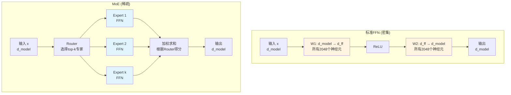

# 第10章：MoE架构深度拆解——DeepSeek V3如何用671B参数达到GPT-4效果？

> **论文链接**：[Attention Is All You Need](https://proceedings.neurips.cc/paper_files/paper/2017/file/3f5ee243547dee91fbd053c1c4a845aa-Paper.pdf) (Vaswani et al., NIPS 2017)  
> **本章对应**：原论文的标准FFN（作为对比基准）  
> **扩展阅读**：DeepSeek-V3 Technical Report (2024)

## 核心困惑

为什么DeepSeek V3能用671B参数达到GPT-4的效果，但推理成本只有1/10？

原论文的FFN是"密集"的——每次前向传播都要计算所有参数：
$$\text{FFN}(x) = \max(0, xW_1 + b_1)W_2 + b_2$$

如果$d_{ff}=2048$，那么$W_1$和$W_2$的所有2048个神经元都会被激活。

但MoE（Mixture of Experts）的核心思想是：**不是所有神经元都需要参与每次计算**。

## 前置知识补给站

### 1. 稀疏激活（Sparse Activation）

**密集激活**（原论文FFN）：
- 所有神经元都参与计算
- 计算量：$O(d_{model} \times d_{ff})$
- 参数量 = 激活参数量

**稀疏激活**（MoE）：
- 只有部分神经元参与计算
- 计算量：$O(d_{model} \times \frac{d_{ff}}{k})$（$k$是稀疏度）
- 参数量 >> 激活参数量

### 2. 专家（Expert）

**定义**：一个专家是一个独立的FFN子网络。

**标准MoE**：
- 将FFN分成$N$个专家
- 每个专家是完整的FFN：$\text{Expert}_i(x) = \max(0, xW_{1,i} + b_{1,i})W_{2,i} + b_{2,i}$
- 每次只激活$k$个专家（$k \ll N$）

### 3. 路由（Router）

**作用**：决定哪些专家被激活。

**路由函数**：
$$\text{Router}(x) = \text{softmax}(xW_g)$$

输出是一个$N$维向量，表示每个专家的"得分"。选择得分最高的$k$个专家。

## 标准FFN vs MoE的数据流对比

**关键区别**：
- 标准FFN：所有神经元都激活
- MoE：只有$k$个专家激活（其他专家的参数不参与计算）

## MoE的数学原理

### MoE的公式

**标准FFN**：
$$\text{FFN}(x) = \max(0, xW_1 + b_1)W_2 + b_2$$

**MoE**：
$$\text{MoE}(x) = \sum_{i=1}^N g_i(x) \cdot \text{Expert}_i(x)$$

其中：
- $g_i(x)$：Router给第$i$个专家的权重
- $\text{Expert}_i(x)$：第$i$个专家的输出
- $N$：专家总数

**稀疏化**：只计算top-$k$个专家：
$$\text{MoE}(x) = \sum_{i \in \text{TopK}(g(x))} g_i(x) \cdot \text{Expert}_i(x)$$

### 为什么MoE有效？

**直观理解**：不同的输入需要不同的"专家"来处理。

**例子**：
- 输入是数学问题 → 激活"数学专家"
- 输入是代码 → 激活"代码专家"
- 输入是诗歌 → 激活"文学专家"

**数学解释**：MoE是一种**条件计算**（Conditional Computation）——根据输入动态选择计算路径。

### 参数量 vs 计算量的解耦

**标准FFN**：
- 参数量：$2 \times d_{model} \times d_{ff}$
- 计算量：$2 \times d_{model} \times d_{ff}$
- 参数量 = 计算量

**MoE**（$N$个专家，每次激活$k$个）：
- 参数量：$N \times 2 \times d_{model} \times d_{ff}$
- 计算量：$k \times 2 \times d_{model} \times d_{ff}$
- 参数量 = $\frac{N}{k}$ × 计算量

**关键洞察**：MoE用$k$倍的计算量，撬动了$N$倍的参数量。

## MoE架构谱系：从GPT-4到DeepSeek V3

| 模型 | MoE类型 | Expert数量 | 每次激活 | 总参数 | 激活参数 | 特点 |
|:-----|:--------|:-----------|:---------|:-------|:---------|:-----|
| GPT-4（据传） | 标准MoE | 8 | 2 | ~1.8T | ~220B | 简单粗暴，负载均衡相对容易 |
| Mixtral 8x7B | 标准MoE | 8 | 2 | 47B | 13B | 开源，每个expert是7B模型 |
| DeepSeek V3 | 细粒度MoE | 256 | 6 | 671B | 37B | 专家更专业化，负载均衡是核心挑战 |

**三种MoE的核心差异**：
- **标准MoE（GPT-4/Mixtral）**：每个expert是完整的FFN，粒度粗
- **细粒度MoE（DeepSeek）**：每个expert只负责FFN的一部分，粒度细

## DeepSeek V3的细粒度MoE设计

### 标准MoE的问题

**标准MoE**（如Mixtral 8x7B）：
- 8个专家，每个专家是完整的7B模型
- 每次激活2个专家
- 问题：专家粒度太粗，专业化程度不够

**例子**：
- 如果输入是"数学+代码"的混合问题
- 标准MoE只能激活2个专家（可能一个擅长数学，一个擅长代码）
- 但如果问题需要3种能力（数学+代码+逻辑），就无法同时激活

### DeepSeek V3的细粒度MoE

**核心思想**：将FFN切分成更细的粒度。

**标准MoE**：
- FFN: $d_{model} \to d_{ff} \to d_{model}$
- 8个专家，每个专家是完整的FFN

**DeepSeek V3**：
- FFN: $d_{model} \to d_{ff} \to d_{model}$
- 256个专家，每个专家只负责$d_{ff}$的一部分
- 每次激活6个专家

**数学表达**：

标准MoE：
$$\text{MoE}(x) = \sum_{i=1}^8 g_i(x) \cdot \text{FFN}_i(x)$$

DeepSeek V3（细粒度MoE）：
$$\text{MoE}(x) = \sum_{i=1}^{256} g_i(x) \cdot \text{Expert}_i(x)$$

其中每个$\text{Expert}_i$只负责FFN的一小部分。

### 为什么细粒度更好？

**优势1：专家更专业化**
- 256个专家 >> 8个专家
- 每个专家可以专注于更细分的任务
- 例如：不是"数学专家"，而是"线性代数专家"、"微积分专家"

**优势2：负载均衡更好**
- 8个专家：容易出现某些专家被过度使用
- 256个专家：负载更容易分散

**优势3：激活更灵活**
- 激活6个专家（而非2个）
- 可以组合更多种能力

## 负载均衡：MoE的核心挑战

### 问题：专家坍缩（Expert Collapse）

**现象**：训练过程中，某些专家总是被选中，其他专家几乎不被使用。

**原因**：
- Router是可学习的：$g(x) = \text{softmax}(xW_g)$
- 如果某个专家在早期表现好，Router会倾向于选择它
- 这个专家得到更多训练，变得更好
- 形成正反馈循环：强者恒强

**后果**：
- 大部分专家的参数被浪费
- 模型退化为少数几个专家的组合
- 失去MoE的优势

### 解决方案1：Auxiliary Loss

**核心思想**：鼓励Router均匀地选择所有专家。

**Auxiliary Loss公式**：
$$\mathcal{L}_{aux} = \alpha \cdot \sum_{i=1}^N f_i \cdot P_i$$

其中：
- $f_i$：第$i$个专家被选中的频率
- $P_i$：第$i$个专家的平均Router得分
- $\alpha$：权重系数

**直观理解**：
- 如果某个专家被选中太多次（$f_i$大），且得分高（$P_i$大），则$\mathcal{L}_{aux}$大
- 优化时会惩罚这种不均衡

### 解决方案2：Expert Capacity

**核心思想**：限制每个专家处理的token数量。

**Expert Capacity**：
$$\text{Capacity} = \frac{\text{总token数} \times k}{N} \times \text{capacity\_factor}$$

其中：
- $k$：每次激活的专家数
- $N$：专家总数
- $\text{capacity\_factor}$：容量因子（通常1.0-1.5）

**例子**（DeepSeek V3）：
- 总token数：1024
- $k=6$，$N=256$
- Capacity = $\frac{1024 \times 6}{256} \times 1.25 = 30$

每个专家最多处理30个token。如果超过容量，多余的token会被丢弃或分配给其他专家。

**注**：在训练时，总token数 = batch中所有序列的token总数。在推理时，每次生成一个新token，总token数 = 1（或beam size）。

### 解决方案3：无辅助损失负载均衡（DeepSeek V3的核心创新）

**传统问题**：Auxiliary Loss可能与主任务冲突——模型需要在"做好任务"和"负载均衡"之间权衡，超参数$\alpha$需要精心调节。

**DeepSeek V3的方案**：动态调整Router的偏置（bias），无需额外的损失项。

**核心思想**：
- 如果某个专家被选中次数过少，就增加它的Router偏置
- 如果被选中次数过多，就减少偏置
- 这种调整是动态的、确定性的，不参与梯度反向传播

**优势**：
- 避免了Auxiliary Loss对训练目标的干扰
- 简化了超参数调节（不需要调$\alpha$）
- 负载均衡更稳定

## DeepSeek V3的推理成本分析

### 参数与激活

DeepSeek V3的总参数量为**671B**，但每次前向传播只激活约**37B**（约5.5%的参数）。

**MoE的稀疏激活是参数效率的关键**：
- 总参数671B中，MoE FFN占绝大部分（约550B，256个专家）
- 每次只激活6个专家，约$550B \times \frac{6}{256} \approx 12.9B$的MoE参数
- 注意力和其他组件在每次前向传播中全部激活

**关键洞察**：推理时，计算量相当于一个37B的密集模型，但模型容量（知识存储能力）等于671B的密集模型。

**参数效率**：
$$\text{参数效率} = \frac{\text{总参数}}{\text{激活参数}} = \frac{671B}{37B} \approx 18.1$$

MoE用5.5%的计算量，撬动了100%的参数量。

### 推理成本对比

| 模型 | 总参数 | 激活参数 | 推理成本 | 效果 |
|:-----|:-------|:---------|:---------|:-----|
| GPT-3 | 175B | 175B | 100% | 基准 |
| GPT-4（据传） | ~1.8T | ~220B | ~125% | 更好 |
| DeepSeek V3 | 671B | 37B | ~21% | 接近GPT-4 |

**关键洞察**：
- DeepSeek V3的推理成本只有GPT-4的1/6
- 但效果接近GPT-4
- 这是MoE的威力：用更少的计算量，撬动更大的参数量

## DeepSeek V3的其他优化

### Multi-Latent Attention (MLA)

**问题**：长文本生成时，KV Cache占用大量内存。

**解决方案**：压缩KV Cache。

**标准Attention**：
- 每个head存储完整的K和V
- KV Cache大小：$2 \times N_{layers} \times N_{heads} \times d_{head} \times n$

**MLA**：
- 多个head共享压缩后的K和V
- KV Cache大小：$2 \times N_{layers} \times d_{latent} \times n$（$d_{latent} \ll N_{heads} \times d_{head}$）

**效果**：KV Cache减少到原来的1/8。

### 训练成本

**DeepSeek V3的训练成本**：
- 14.8M GPU小时（H800）
- 训练数据：14.8T tokens
- 训练时间：约2个月

**对比**：
- GPT-3：~3.14M GPU小时（V100）
- GPT-4：未公开（估计>100M GPU小时）

**关键洞察**：DeepSeek V3的训练成本远低于GPT-4，但效果接近。

## 2026年的批判性视角

### 1. MoE不是新技术

**历史**：
- MoE的概念在1991年就提出了（Jacobs et al.）
- 2017年，Google Brain将MoE应用于Transformer（Shazeer et al.）
- 但直到2023年，MoE才在大语言模型中流行（Mixtral、GPT-4）

**为什么现在才流行**：
- 硬件进步：GPU内存和带宽提升，支持大规模稀疏计算
- 工程优化：负载均衡、Expert Capacity等技术成熟
- 规模效应：模型越大，MoE的优势越明显

### 2. MoE的局限

**问题1：训练复杂度**
- 负载均衡需要精心调优
- Auxiliary Loss的权重$\alpha$需要实验
- Expert Capacity的设置影响性能

**问题2：通信开销**
- 分布式训练时，不同GPU上的专家需要通信
- 通信开销可能抵消计算节省

**问题3：推理延迟**
- 虽然计算量少，但Router的选择增加了延迟
- 对于实时应用（如对话），延迟可能是瓶颈

### 3. DeepSeek V3的创新

**创新点**：
- 细粒度MoE：256个专家 vs 8个专家
- MLA：压缩KV Cache
- 负载均衡：Auxiliary Loss + Expert Capacity

**为什么DeepSeek V3成功**：
- 工程优化到极致
- 训练数据质量高（14.8T tokens）
- 开源：社区可以验证和改进

## MoE的未来

### 趋势1：更细粒度的专家

**当前**：DeepSeek V3有256个专家

**未来**：可能有1000+个专家

**挑战**：负载均衡更困难

### 趋势2：动态专家数量

**当前**：每次激活固定数量的专家（如6个）

**未来**：根据输入复杂度动态调整激活的专家数量

**例子**：
- 简单问题：激活2个专家
- 复杂问题：激活10个专家

### 趋势3：多层次MoE

**当前**：只在FFN层使用MoE

**未来**：在Attention层也使用MoE

**例子**：
- 不同的Attention head专注于不同的模式
- Router选择激活哪些head

## 面试追问清单

### ⭐ 基础必会

1. **MoE的核心思想是什么？**
   - 提示：稀疏激活、条件计算

2. **MoE如何解耦参数量和计算量？**
   - 提示：$N$个专家，每次激活$k$个

3. **什么是专家坍缩（Expert Collapse）？**
   - 提示：某些专家被过度使用，其他专家被浪费

### ⭐⭐ 进阶思考

4. **DeepSeek V3的细粒度MoE和标准MoE有什么区别？**
   - 提示：256个专家 vs 8个专家，粒度更细

5. **如何解决MoE的负载均衡问题？**
   - 提示：Auxiliary Loss、Expert Capacity

6. **为什么DeepSeek V3的推理成本只有GPT-4的1/10？**
   - 提示：671B参数，但每次只激活37B

### ⭐⭐⭐ 专家领域

7. **MoE的通信开销如何影响分布式训练？**
   - 提示：不同GPU上的专家需要通信

8. **如何设计一个动态调整激活专家数量的MoE？**
   - 提示：根据输入复杂度、Router的置信度

9. **MoE在Attention层的应用有什么挑战？**
   - 提示：Attention的计算模式与FFN不同

---

**下一章预告**：第11章将深入拆解长文本优化，回答"Kimi如何突破200K+ tokens？Attention Residuals是什么？"

**论文原文传送门**：
- Transformer原论文：https://proceedings.neurips.cc/paper_files/paper/2017/file/3f5ee243547dee91fbd053c1c4a845aa-Paper.pdf
- Outrageously Large Neural Networks (MoE原论文)：https://arxiv.org/abs/1701.06538
- DeepSeek-V3 Technical Report：https://arxiv.org/abs/2412.19437
