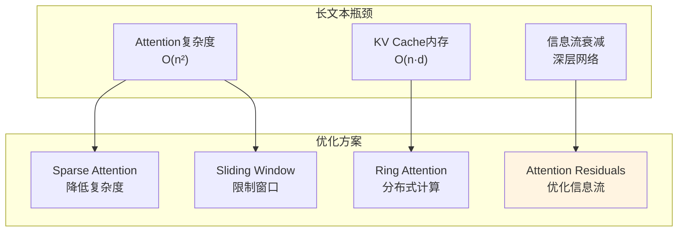

# 第11章：长文本之战——Kimi如何突破200K+ tokens？

> **论文链接**：[Attention Is All You Need](https://proceedings.neurips.cc/paper_files/paper/2017/file/3f5ee243547dee91fbd053c1c4a845aa-Paper.pdf) (Vaswani et al., NIPS 2017)  
> **本章对应**：原论文的标准残差连接（作为对比基准）  
> **扩展阅读**：Kimi Technical Report (Moonshot AI, 2024)

## 核心困惑

为什么Kimi能处理200K+ tokens，而原论文的Transformer只能处理512 tokens？

原论文的Transformer有三个长文本瓶颈：
1. **Attention复杂度**：$O(n^2)$，序列长度翻倍，计算量翻4倍
2. **KV Cache内存**：$2 \times N_{layers} \times d_{model} \times n$，200K tokens需要几十GB
3. **深层网络的信息流**：96层网络中，底层的信息如何有效传递到顶层？

Kimi的解决方案不是"减少计算量"（如Sparse Attention），而是**优化信息流**——重新设计残差连接。

## 前置知识补给站

### 1. 长文本的三大瓶颈

**瓶颈1：Attention复杂度**

标准Attention的复杂度：
$$O(n^2 \cdot d)$$

**数值示例**：
- 512 tokens：$512^2 = 262K$ 次点积
- 200K tokens：$(200K)^2 = 40B$ 次点积（增加152,000倍）

**瓶颈2：KV Cache内存**

每个token需要存储K和V：
$$\text{KV Cache} = 2 \times N_{layers} \times d_{model} \times n$$

**数值示例**（GPT-3规模：96层，$d_{model}=12288$）：
- 512 tokens：$2 \times 96 \times 12288 \times 512 \approx 1.2GB$
- 200K tokens：$2 \times 96 \times 12288 \times 200K \approx 470GB$

**瓶颈3：深层网络的信息流**

96层网络中，第1层的信息要经过95次残差连接才能到达第96层。信息会衰减吗？

### 2. 标准残差连接的回顾

**原论文的残差连接**（Post-LN）：
$$y = \text{LayerNorm}(x + \text{Sublayer}(x))$$

**现代模型的残差连接**（Pre-LN）：
$$y = x + \text{Sublayer}(\text{LayerNorm}(x))$$

**关键特性**：残差连接是**固定的加法**——每层的输出是输入加上子层的变换。

## 长文本优化方案对比

| 方案 | 核心思想 | 代表模型 | 复杂度 | 优点 | 缺点 |
|:-----|:---------|:---------|:-------|:-----|:-----|
| **Sparse Attention** | 只计算部分位置的attention | Longformer, BigBird | O(n·k) | 复杂度降到线性 | 可能丢失长距离依赖 |
| **Sliding Window** | 每个token只看局部窗口 | Mistral 7B | O(n·w) | 实现简单，内存可控 | 窗口外的信息完全丢失 |
| **Ring Attention** | 分布式计算，GPU间轮转KV | 学术方案 | O(n²) | 理论上可无限扩展 | 通信开销大，工程复杂 |
| **Attention Residuals** | 改残差机制，动态聚合历史层 | Kimi | O(n²) | 不牺牲attention精度 | 需要重新设计训练流程 |

**Kimi的选择为什么不同**：
- 其他方案都在**动Attention本身**（稀疏化、窗口化、分布式），牺牲了精度
- Kimi选择**动残差连接**，保留了O(n²)的全注意力，但通过动态聚合历史层来提升长文本能力
- 这是一个"不走寻常路"的设计：别人在减少计算量，Kimi在优化信息流

## Kimi的Attention Residuals (AttnRes)

### 标准残差连接的问题

**标准残差连接**（PreNorm）：
$$h_l = h_{l-1} + f_l(\text{LayerNorm}(h_{l-1}))$$

**问题0（最本质）：PreNorm稀释**

Kimi论文指出，PreNorm架构下的固定残差累加会导致两个问题：
1. **隐藏状态增长**：每层累加，$h_l$的范数随深度增长
2. **层贡献稀释**：早期层对最终输出的相对贡献被稀释到约$1/L$

**数学解释**：
- 第1层的输出$h_1$经过95次加法到达第96层
- 第96层的输出：$h_{96} = h_1 + f_2(h_1) + f_3(h_2) + ... + f_{96}(h_{95})$
- $h_1$的相对贡献：$\frac{\|h_1\|}{\|h_{96}\|} \approx \frac{1}{96}$（假设每层贡献相近）

**AttnRes的核心动机**：通过动态聚合让模型可以选择给早期层更高的权重，避免信息被稀释。

**问题1：信息衰减**
- 第1层的信息要经过95次加法才能到达第96层
- 每次加法都可能稀释原始信息

**问题2：固定的聚合方式**
- 每层只能看到前一层的输出
- 无法直接访问更早层的信息

**问题3：长文本时的梯度流**
- 深层网络中，梯度需要反向传播96层
- 长序列会加剧梯度不稳定

### Attention Residuals的核心思想

**核心洞察**：用**学习的attention**替代**固定的加法**。

**标准残差连接**（固定加法）：
$$h_l = h_{l-1} + f_l(h_{l-1})$$

**Attention Residuals**（学习的attention）：
$$h_l = \sum_{i=0}^{l-1} \alpha_{i\to l} \cdot h_i$$

其中：
- $h_i$：第$i$层的完整输出（已包含该层的Attention、FFN和残差）
- $\alpha_{i\to l}$：第$i$层到第$l$层的attention权重

**直观理解**：
- 标准残差：每层只能看到前一层
- AttnRes：每层可以看到**所有历史层的输出**，并动态选择聚合哪些层

### Attention Residuals的数学表达

**完整公式**：
$$h_l = \sum_{i=0}^{l-1} \alpha_{i\to l} \cdot h_i$$

其中$\alpha_{i\to l} = \text{softmax}(\text{score}(h_l, h_i))$是学习的层间attention权重。

**Attention权重的计算**：
$$\text{score}(h_l, h_i) = \frac{(h_l W^Q)(h_i W^K)^T}{\sqrt{d}}$$

**关键特性**：
- $\alpha_{i\to l}$是动态的，取决于当前层的状态
- 每层可以选择性地聚合历史层的信息
- 类似于Attention机制，但作用于层之间而非token之间
- 聚合的是完整的层输出$h_i$，而非仅子层变换

### 为什么Attention Residuals有效？

**优势1：直接访问早期层**
- 第96层可以直接访问第1层的信息
- 避免了95次加法的信息衰减

**优势2：动态选择信息源**
- 不同的输入可能需要不同的层组合
- 简单问题：主要依赖浅层
- 复杂问题：需要深层的抽象

**优势3：更好的梯度流**
- AttnRes让第$l$层对任意前面层$h_i$的梯度中都包含直接的$\alpha_{i\to l}$项
- 相比标准残差只能通过相邻层逐层回传，AttnRes的梯度路径更短
- 这种设计类似于DenseNet的思想，但用学习的attention权重替代了固定的拼接

### Block Attention Residuals

**问题**：如果每层都聚合所有历史层，内存和计算开销是$O(L^2 \cdot d)$（$L$是层数）。

**解决方案**：将层分组成块（Block），只在块之间使用AttnRes。

**Block AttnRes**：
- 将96层分成16个块，每块6层
- 块内使用标准残差连接
- 块之间使用Attention Residuals

**内存开销**：
- 标准残差：$O(L \cdot d)$
- 全层AttnRes：$O(L^2 \cdot d)$
- Block AttnRes：$O(N \cdot d)$（$N$是块数，$N \ll L$）

**数值示例**（96层，16块）：
- 标准残差：存储96个中间状态
- 全层AttnRes：存储$96 \times 96 = 9216$个attention权重
- Block AttnRes：存储$16 \times 16 = 256$个attention权重

## 其他长文本优化方案

### 1. Sparse Attention

**核心思想**：只计算部分位置的attention。

**Longformer的方案**：
- 局部窗口：每个token只看前后$w$个token
- 全局token：少数特殊token（如[CLS]）可以看到所有token
- 复杂度：$O(n \cdot w)$

**优点**：
- 复杂度从$O(n^2)$降到$O(n)$
- 可以处理16K+ tokens

**缺点**：
- 窗口外的长距离依赖可能丢失
- 需要精心设计哪些token是"全局"的

### 2. Sliding Window Attention

**核心思想**：每个token只看固定大小的窗口。

**Mistral 7B的方案**：
- 窗口大小：4096 tokens
- 每个token只看前4096个token
- 复杂度：$O(n \cdot w)$

**优点**：
- 实现简单
- 内存可控

**缺点**：
- 窗口外的信息完全丢失
- 无法建模超过4096 tokens的长距离依赖

### 3. Ring Attention

**核心思想**：分布式计算，GPU间轮转KV Cache。

**工作原理**：
1. 将序列分成$N$段，分配给$N$个GPU
2. 每个GPU计算自己负责的Q对所有K的attention
3. KV Cache在GPU间轮转，每个GPU依次计算

**优点**：
- 理论上可以无限扩展序列长度
- 保留了完整的$O(n^2)$ attention

**缺点**：
- 通信开销大（KV Cache需要在GPU间传输）
- 工程复杂度高
- 需要高速互联（如NVLink）

### 4. Claude的方案（未公开）

**已知信息**：
- Claude 3可以处理200K tokens
- Claude 3.5可以处理1M tokens（实验性）

**推测的技术栈**：
- Sliding Window + Sparse Attention的组合
- 可能使用了类似Longformer的全局token机制
- 可能使用了KV Cache压缩（如MQA/GQA）

## Kimi的架构要点

### Kimi Linear (48B total / 3B activated)

**架构特点**：
- 总参数：48B
- 激活参数：3B（MoE架构）
- 上下文长度：200K+ tokens

**为什么用MoE**：
- 长文本推理时，KV Cache已经占用大量内存
- MoE的稀疏激活减少了计算量
- 48B参数的容量，3B的推理成本

### 训练数据

**预训练数据**：1.4T tokens

**长文本训练策略**：
- 逐步增加序列长度（从4K到200K）
- 使用Attention Residuals提升长文本能力
- 混合短文本和长文本数据

### 效果对比

**Kimi vs GPT-4（200K上下文）**：
- 长文本理解：Kimi略优
- 长文本生成：接近GPT-4
- 推理成本：Kimi更低（3B激活 vs GPT-4的220B激活）

## 2026年的批判性视角

### 1. Attention Residuals的代价

**优势**：
- 更好的信息流
- 更好的长文本能力

**代价**：
- 训练复杂度增加（需要学习层间attention）
- 推理时需要存储所有块的中间状态
- 工程实现复杂

**权衡**：
- 对于长文本任务，代价是值得的
- 对于短文本任务，标准残差连接可能更高效

### 2. 长文本的真实需求

**问题**：用户真的需要200K tokens的上下文吗？

**数据**：
- 大部分对话：< 4K tokens
- 代码补全：< 16K tokens
- 文档问答：< 32K tokens

**真正需要200K的场景**：
- 长篇小说分析
- 大型代码库理解
- 多轮对话历史

**结论**：200K是"能力上限"，但日常使用中很少触及。

### 3. 长文本的未来

**趋势1：更长的上下文**
- Claude 3.5：1M tokens（实验性）
- Gemini 1.5：2M tokens（实验性）

**趋势2：更高效的方法**
- 不是简单地"堆更多内存"
- 而是重新设计架构（如Attention Residuals）

**趋势3：混合方案**
- 短文本：标准Attention
- 长文本：Sparse Attention + Attention Residuals
- 根据输入长度动态选择

## 长文本优化的工程实践

### 1. KV Cache压缩

**MQA（Multi-Query Attention）**：
- 所有head共享同一个K和V
- KV Cache减少到$\frac{1}{h}$（$h$是head数）

**GQA（Grouped-Query Attention）**：
- 多个head共享一个K和V
- 介于MHA和MQA之间

**效果**：
- LLaMA 2使用GQA，KV Cache减少到原来的1/8
- 推理速度提升，内存占用降低

### 2. FlashAttention

**核心思想**：优化Attention的内存访问模式。

**标准Attention的问题**：
- 需要存储完整的attention矩阵（$n \times n$）
- 内存访问次数多

**FlashAttention的优化**：
- 分块计算，减少内存访问
- 在SRAM中完成大部分计算
- 不存储完整的attention矩阵

**效果**：
- 速度提升2-4倍
- 内存占用降低

### 3. 动态序列长度

**核心思想**：根据任务动态调整序列长度。

**实现**：
- 短任务：使用较短的上下文（如4K）
- 长任务：使用较长的上下文（如200K）
- 根据输入长度自动选择

**效果**：
- 平均推理成本降低
- 用户体验不受影响

## 面试追问清单

### ⭐ 基础必会

1. **长文本的三大瓶颈是什么？**
   - 提示：Attention复杂度、KV Cache内存、信息流衰减

2. **Sparse Attention和Sliding Window Attention有什么区别？**
   - 提示：Sparse Attention选择性计算，Sliding Window固定窗口

3. **什么是KV Cache？为什么它是长文本的瓶颈？**
   - 提示：存储历史token的K和V，内存占用$O(n \cdot d)$

### ⭐⭐ 进阶思考

4. **Attention Residuals和标准残差连接有什么区别？**
   - 提示：学习的attention vs 固定的加法

5. **为什么Kimi选择Attention Residuals而不是Sparse Attention？**
   - 提示：不牺牲attention精度，优化信息流

6. **Block Attention Residuals如何减少内存开销？**
   - 提示：将层分组成块，只在块之间使用AttnRes

### ⭐⭐⭐ 专家领域

7. **如何设计一个混合的长文本优化方案？**
   - 提示：短文本用标准Attention，长文本用Sparse + AttnRes

8. **Ring Attention的通信开销如何影响性能？**
   - 提示：KV Cache需要在GPU间传输，需要高速互联

9. **Attention Residuals在训练时如何避免过拟合？**
   - 提示：Dropout、层间attention的正则化

---

**系列完结**：前11章完成了Transformer从原论文到现代架构的完整拆解。第12章将提供综合面试演练。

**论文原文传送门**：
- Transformer原论文：https://proceedings.neurips.cc/paper_files/paper/2017/file/3f5ee243547dee91fbd053c1c4a845aa-Paper.pdf
- Kimi Technical Report：https://arxiv.org/abs/2603.15031
- Longformer：https://arxiv.org/abs/2004.05150
- FlashAttention：https://arxiv.org/abs/2205.14135
